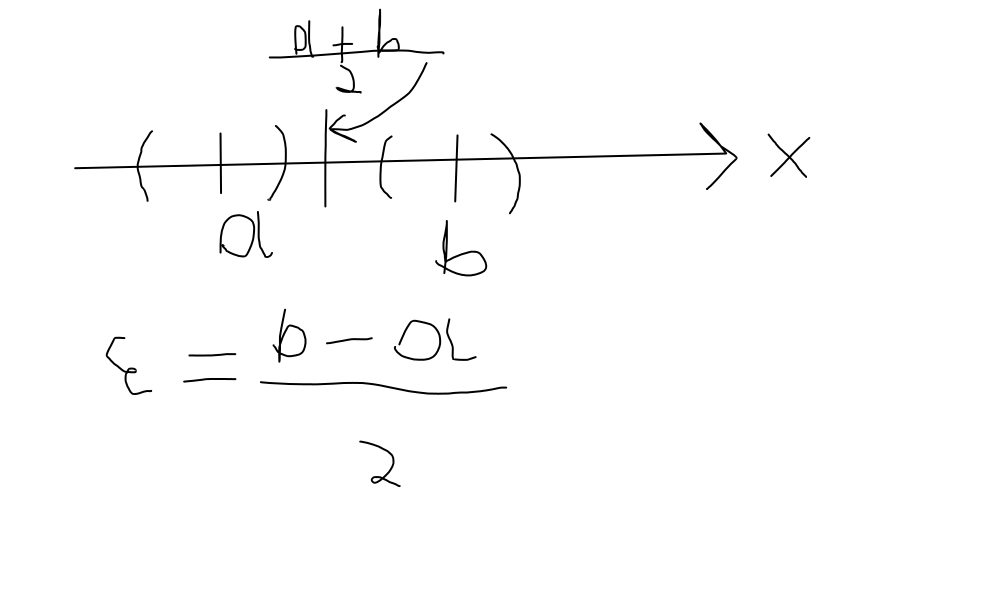

# Счётные множества
**Утверждение** $\R$ - не счётно

*Доказательство (от противного)*: $\R$ - счётно, значит все элементы можно занумеровать, $[0,1] \subset \R$

$\Rightarrow [0,1] - \textrm{конечно или счётно, а из т. Кантера [0,1] - не счётно}$

# Последовательности

**Последовательность** - $f: \N \to \R$

*Задать последовательность* - задать пару $(n, a_n)$, где $n$ - номер элемента последовательности, а $a_n$ - значение. Также последовательность называют занумерованным множеством. Последовательность обозначают как $\{a_n\}$ или как $\{a_n\}_{n\in\N}$, если есть другой контекст. В целом $\{a_n\} = \{a_n\}_{n\in\N}$.

*Определение*:
$\{a_n\} - ограничена \Leftrightarrow \exists a, b \in \R \quad \forall n \in \N \to a \le a_n \le b\\
\{a_n\} - неограничена \Leftrightarrow (\forall a, b, \in \R|a < b)(\exists n_0 \in \N): a_{n_0} < a \vee a_{n_0} > b
$

> Неограниченность хотя бы с одной стороны, ограниченность с двух

*Способы задания последовательности*:

$(n, a_n) - \textrm{общий член последовательности} - a_n \textrm{(для краткости)}$
- формула:$\ a_n = f(n) \quad a_n = \frac{1}{n}, a_n = (-1)^n$
- рекурентная формула:$\ a_{n+1}=\sqrt{3+a_n}$
- словесное описание: $a_n$ - число, стоящее на n-ом месте после запятой в число $\sqrt{2}$

Множество значений последовательности - **конечно или счётно**
- Счётно, потому что соответствие $\N$
- Конечно, например, $\{(-1)^n\} = \{-1,1,-1,1,\dots\}$, но множество значения $= \{-1,1\}$

$\{a_n\}$ - возрастающая (неубывающая)
$\Leftrightarrow \forall n \in \N \to x_n \le x_{n+1}$

$\{a_n\}$ - убывающая
$\Leftrightarrow \forall n \in \N \to x_n \ge x_{n+1}$

Это монотонные последовательности

Строго монотонные
$\Leftrightarrow$ $\textrm{строго возрастающие}(x_{n+1} > x_n) \\ \textrm{строго убывающие} (x_{n+1} < x_n)$

# Предел последовательности

**Определение**:
$\overline{\R}\ni a = \displaystyle\lim_{n \to \infty} x_n \Leftrightarrow (\forall \epsilon > 0)(\exists n_{\epsilon} \in \N)(\forall n \in \N | n \ge n_{\epsilon}): x_n \in \cup_{\epsilon}(a)$

Окрестности:
$\cup(a) = (b, c): a \in (b,c)$ - произвольная окрестность

$\cup_{\epsilon}=(a-\epsilon,a+\epsilon)=\{x: |x-a| < \epsilon\}$

$\cup_{\epsilon}=(-\infty;-\frac{1}{\epsilon}) \Leftrightarrow \cup{\epsilon}(-\infty)=(-\infty;-E)\Leftrightarrow \cup_{-A}(-\infty)=(-\infty;A)$

$\cup_{\epsilon}=(\frac{1}{\epsilon};+\infty), \quad \cup_{\epsilon}(\infty)=\cup_{\epsilon}(-\infty)\cup\cup_{\epsilon}(+\infty) = \{x: |x| > \frac{1}{\epsilon}\}$

$\R \ni a = \lim_{n \to \infty}x_n \Leftrightarrow (\forall \epsilon > 0)(\exists n_{\epsilon} \in \N)(\forall n \ge n_{\epsilon}): |x_n - a| < \epsilon \quad (1)$

Пример: доказать, что $2 = \lim_{n \to \infty} \frac{2n-1}{n+2}$

$Пусть\ \epsilon > 0 \quad \exists n_{\epsilon} = \forall n \ge n_{\epsilon} \to |\frac{2n-1}{n+2}-2| = |\frac{-5}{n+2}| = \frac{5}{n+2} < \frac{5}{n} < \epsilon$

$n > 5 \epsilon \quad [\frac{5}{\epsilon}]+1\in\N > \frac{5}{\epsilon}$

$\Rightarrow 2 = \lim_{n\to\infty}\frac{2n-1}{n-2}$

$\R \ni a \ne \lim_{n\to\infty}x_n\Leftrightarrow (\exists\epsilon>0)(\forall n_{\epsilon} \in \N)(\exists n \ge n_e): |x_n -a| \ge \epsilon$

**Определение**:
- $\{x_n\}$ - сходящаяся $\Leftrightarrow \exists a \in \R: a = \lim_{n\to\infty}x_n$
- $\{x_n\}$ - несходящаяся $\displaystyle\lim_{n\to\infty}x_n=\infty \vee \lim_{n\to\infty}x_n - $ не существует

$(\forall \epsilon > 0)(\exists n_{\epsilon} \in \N)(\forall n \ge n_{\epsilon}): |x_n - a| \le \epsilon \Leftrightarrow (1)$

$(1) \Rightarrow |x_n-a| < \epsilon \Rightarrow |x_n-a| \le \epsilon, n_{\epsilon}^2 = n_{\epsilon}^1$

$(1) \Leftarrow |x_n-a| \le \frac{\epsilon}{2} < \epsilon \quad n_{\epsilon}^1=n_{\frac{\epsilon}{2}}^2$

> Дома проверить что будет если $(\forall \epsilon > 0)(\exists n_{\epsilon} \in \N)(\forall n > n_{\epsilon}): |x_n - a| \le \epsilon$, что будет в одно сторону и в другую сторону

**Лема (о непересечении окрестностей)**:
$(\forall a, b \in \overline{\R} | a \ne b)(\exists \epsilon > 0) : \cup_{\epsilon}(a) \cap \cup_{\epsilon}(b) = \varnothing$

*Доказательство*:
$Пусть\ a < b, \textrm{ нужно найти } \epsilon: x\in \cup_{\epsilon}(a), y \in \cup_{\epsilon}(b): x < y$

1. $-\infty < a < b < +\infty$
2. $-\infty = a < b < +\infty$
3. $-\infty < a < b = +\infty$
4. $-\infty = a < b = +\infty, \epsilon = 1 : x < -1 < 1 < y \quad x \in \cup_{\epsilon}(-\infty) \Leftrightarrow x = -\frac{1}{\epsilon} \quad \textrm{аналогично для }y$

Доказательство

1. $\cup_{\epsilon}(a)=(a-\epsilon;b+\epsilon) = x < a + \epsilon = a + \frac{b-a}{2}=\frac{a+b}{2} = b-\epsilon<y\in(b-\epsilon;b+\epsilon)=\cup_{\epsilon}(b)$
2. $\epsilon = \frac{1}{|b|+1}$ - проверить
3. $\epsilon = \frac{1}{|a|+1}$ - проверить

