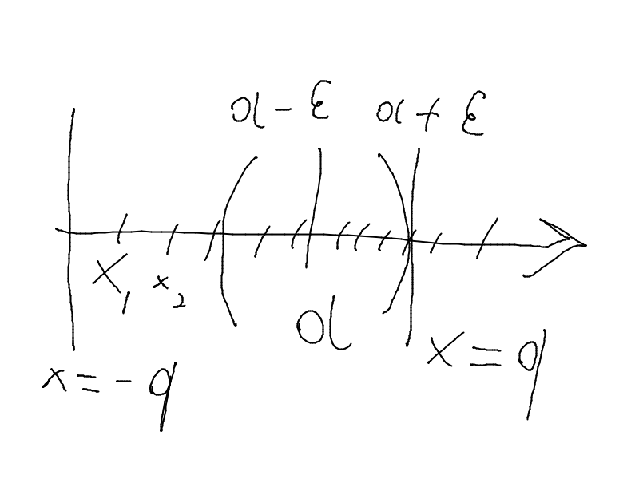
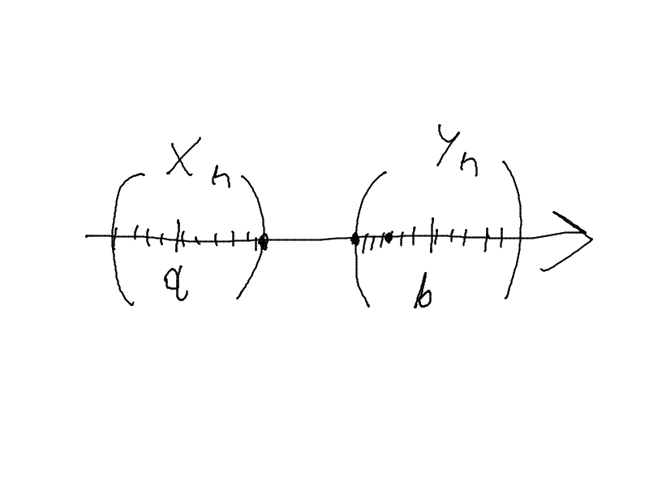

# Предел последовательности
**Теорема (о единственность предела)**: любая последовательность имеет не более одного предела в $\overline{\R}$.

*Доказательство (от противного)*:

$a_1 = \displaystyle\lim_{n \to \infty} x_n \Rightarrow (\forall \epsilon >0)(\exists n_1 \in \N)(\forall n \ge n_1) : x_n \in \cup_{\epsilon}(a_1) \quad (1)\\
a_2 = \lim_{n \to \infty} x_n \Rightarrow (\forall \epsilon >0)(\exists n_2 \in \N)(\forall n \ge n_2) : x_n \in \cup_{\epsilon}(a_2) \quad (2)$

$a_1 < a_2, \epsilon > 0, n_{\epsilon}=\max\{n_1, n_2\} \Rightarrow (1, 2) \quad x_n \in \cup_{\epsilon}(a_1) \wedge \cup_{\epsilon}(a_2)$

$\Rightarrow \textrm{противоречие } \exists \epsilon >0 : \cup_{\epsilon} \cap \cup_{\epsilon}(a_2) = \varnothing$

$\Rightarrow \textrm{предположение неверное и } a_1 = a_2 \Rightarrow \textrm{единственный предел в } \overline{\R} \quad \not\exists a: a = \displaystyle\lim_{n\to\infty}x_n$

## Бесконечномалые и бесконечнобольшие последовательности
**Определение**: $\{x_n\}$ - бесконечномалая последовательность $\displaystyle\lim_{n\to\infty}x_n=0$

*Следствие*: $\{x_n\} - б.м.п. \Rightarrow  \{x_n\} - \textrm{сходящаяся}$

**Определение**: $\{x_n\}$ - бесконечнобольшая последовательность $\displaystyle\lim_{n\to\infty}x_n=\infty \Leftrightarrow (\forall \exists > 0)(\exists n_{\epsilon} \in \N)(\forall n \ge n_{\epsilon}) : |x_n| > \frac{1}{\epsilon} $

*Следствие*: $\{x_n\} - б.б.п. \Rightarrow  \{x_n\} - \textrm{рассходящаяся и неограниченная} \Leftrightarrow (\forall q \in \R)(\exists n_q \in \N): |x_{n_q}| > q $

*Пример неограниченной не бесконечнобольшой*: $x_n = n + (-1)^n$

Сходящаяся $\Rightarrow \\ \not\Leftarrow \\  \not\Leftrightarrow$ ограниченная

**Теорема о сходимости ограниченной последовательности**: Любая сходящаяся последовательность ограничена

*Доказательство*: $\{x_n\} - сходящаяся \Leftrightarrow \exists \R \ni a = \displaystyle\lim_{n\to\infty}x_n \Rightarrow (\forall \epsilon)(\exists n_{\epsilon}\in\N)(\forall n \le n_{\epsilon}) : |x_n - a| < \epsilon$

$|x_n-a|<\epsilon \Leftrightarrow a - \epsilon < x_n < a + \epsilon\\
q = \max\{ |x_1|, |x_2|, \dots, |x_{n_{\epsilon}}|, |a - \epsilon|, |a+\epsilon|\} \Leftrightarrow \forall n \in \N \to |x_n| \le q \Rightarrow \{x_n\} - ограничена \\
-q \le x_n \le q
$

**Теорема (о произведении бесконечномалой последовательности на ограниченной последовательности)**:
произведение бесконечномалой последовательности $x_n$ на ограниченную последовательсноть $\alpha_n$ является бесконечномалой последовательностью

*Доказательство*:$\{x_n\} - \textrm{бесконечномалая последовательность} \Rightarrow (\forall \epsilon > 0)(\exists n_1 \in \N)(\forall n \le n_1): |x_n| < \epsilon\\
\{y_n\} - ограниченная \Rightarrow (\exists q \in \R)(\forall n \in \N): |y_n| \le q$
$|x_n\cdot y_n| = |x_n|\cdot|x_y| \le |x_n|\cdot q < \epsilon q = \epsilon_1\\
(\forall \epsilon_1 > 0)(\exists n_{\epsilon}=n_1(\frac{\epsilon_1}{q}))(\forall n \le n_{\epsilon_1}): |x_n x_y| \le \epsilon_1 \Rightarrow \displaystyle\lim_{n\to \infty}(x_n x_y) = 0 \Rightarrow \{x_n y_n\} - \textrm{бесконечномалая последовательность}
$

*Следствие*:$\{x_n\} - сходящаяся \Leftrightarrow \{x_n - a\} - \textrm{бесконечномалая последовательность}$

**Теорема (об арифметических операциях на бесконечномалых последовательностях)**:

$\{\alpha_n\}, \{\beta_n\} - б.м.п. \Rightarrow 1)\ \{\alpha_n \pm \beta_n\} - бмп \quad 2)\ \{\alpha_n \cdot \beta_n\} - бмп$ (Доказать самому -_-)

## Свойства сходящихся последовательностей

### I. Свойства неравенствами
**Т1**: $a = \displaystyle\lim_{n\to\infty}x_n, \quad b =\displaystyle\lim_{n\to\infty}y_n, \quad a < b \Rightarrow (\exists n_0 \in \N)(\forall n \ge n_0): x_n < y_n$

Доказательство: $a < b \quad \exists \epsilon > 0 : \cup_{\epsilon}(a) \cap \cup_{\epsilon}(b) \ne \varnothing$

$a = \displaystyle\lim_{n\to\infty}x_n \Rightarrow (\forall \epsilon > 0)(\exists n_1 \in \N)(\forall n \ge n_1): x_n \in \cup_{\epsilon}(a)\\b = \displaystyle\lim_{n\to\infty}y_n \Rightarrow (\forall \epsilon > 0)(\exists n_2 \in \N)(\forall n \ge n_2): y_n \in \cup_{\epsilon}(b) \\ \exists : \epsilon > 0, \exists n_0 = \max\{n_1,n_2\} : \forall n \ge n_0 \to x_n < a + \epsilon < b - \epsilon < y_n \Rightarrow x_n < y_n$

? $a \le b \Rightarrow x_n \le y_n$

Пример: $x_n = \frac{1}{n} \quad y_n = \frac{1}{2n}$
$\Rightarrow неверно \\ a \le b \not\Rightarrow x_n \le y_n$

**Т2**: $a = \displaystyle\lim_{n\to\infty}x_n, \quad b =\displaystyle\lim_{n\to\infty}y_n, \quad (\exists n_0 \in \N)(\forall n \ge n_0): x_n \le y_n \Rightarrow a \le b$

*Доказательство (от противного)*:

$a > b \ (Т1)\Rightarrow \exists n_0 \in \N : \forall n \le n_0 \to x_n > y_n - противоречие \ \Rightarrow x_n \le y_n$

? $x_n < y_n \Rightarrow a < b \ - \textrm{невсегда}$

**Т3 (о зажатой последовательности)**:

$(\exists n_0 \in \N)(\forall n \ge n_0) : x_n \le y_n \le z_n, \displaystyle\lim_{n\to\infty}x_n = \displaystyle\lim_{n\to\infty}z_n = a \Rightarrow \{y_n\} - сходящаяся : \displaystyle\lim_{n\to\infty}y_n = a$

*Пояснение к доказательству*:

$(\forall \epsilon > 0)(\exists n_{\epsilon} = \max \{n_0,n_1,n_2\})(\forall n \ge n_{\epsilon}) : |y_n - a| < \epsilon \Leftrightarrow -\epsilon < x_n - a \le y_n - a \le z_n - a < \epsilon \Rightarrow |y_n-a| < \epsilon$ (т.к. $x_n \to a$)

### II. Арифметические свойства

$a = \displaystyle\lim_{n\to\infty}x_n, \quad b =\displaystyle\lim_{n\to\infty}y_n$

1. $\displaystyle\lim_{n\to\infty}(x_n\pm y_n) = a \pm b$

2. $\displaystyle\lim_{n\to\infty}(x_n\cdot y_n) = a \cdot b$

3. $\exists n_0 \le \N : \forall n \ge n_0 \to y_n \ne 0, b \ne 0 \Rightarrow \exists \displaystyle\lim_{n\to\infty}\frac{x_n}{y_n} = \frac{a}{b} (|\frac{x_n}{y_n} - \frac{a}{b}| < \epsilon)$

Замечание: в этих свойствах равенство одностороннее

**Теорема (связь ббп и бмп)**:

$\{x_n\} - бмп, \exists n_0 \in \N : \forall n \to x_n \ne 0 \Rightarrow \{\frac{1}{x_n}\} - ббп \quad (\frac{1}{0 \notin \R} = \infty)$
$\{x_n\} - ббп, \{\frac{1}{x_n}\} - бмп \quad (\frac{1}{0 \notin \R} \to \infty)$