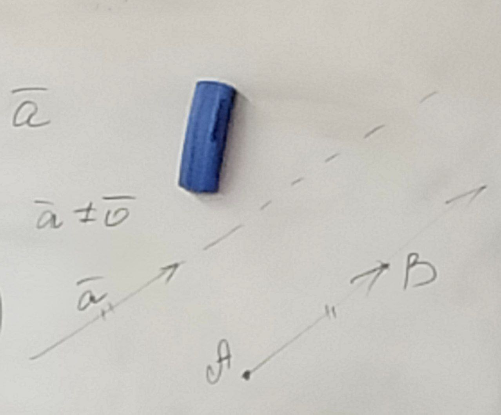
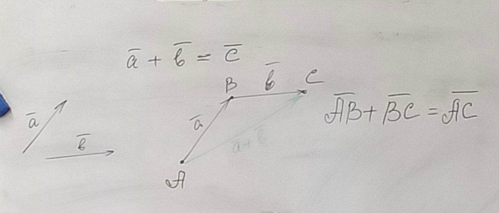

# Элементы векторной алгебры

**Определение**: Отрезок называется **направленным отрезком**, если пара точек, являющихся его началом упорядочена.

**Определение**: Два направленных отрезка называются **эквивалентными**, если они либо оба нулевые, либо имеют одинаковые длину или направление.

**Определение**: геометрическим вектором называется класс эквивалентности направленных отрезков

Класс эквивалентных направленных отрезков можно задать:
1. Одним из ориентированных отрезков
2. Парой упорядоченных точек
3. В случае ненулевого вектора длинной и направлением

## Откладывание вектора от точки

Свойства:
1. $\forall \overline{a} \in V$ и $\forall A \in E$ $\quad \exists! B \in E : \overline{AB} = \overline{a}\quad$ (V - множество векторов, E - множество точек)

*Доказтельсвто*:

1. $\overline{a} = \overline{0} \Rightarrow B = A$
2. $\overline{a} \ne \overline{0}$

Проведём через точку A прямую параллельную вектору a, зададим ей то же направлние и отложим от неё отрезок равный данному.

## Сложение векторов

Пусть $\overline{a}$ и $\overline{b}$ - любые два вектора, тогда получаем вектора $\overline{a} + \overline{b} = \overline{c}$, который можно получить по правилу треугольника.

От конца вектора a откладываем вектор b, и вектор, начала которого совпадает с началом вектором a, а конец с концом вектора b, называется их суммой.

Свойства:
1. Для любых двух векторов их сумма определена и однозначна
2. Существование и единственность нулевого вектора $\exists! \overline{0} : \forall \overline{a}\in V \overline{a} + \overline{0} = \overline{a}$
3. Существование противоположного вектора $\forall \overline{a} \in V \quad \exists(-\overline{a}) : \overline{a} + (-\overline{a}) = 0$
4. Коммутативность $\forall \overline{a}, \overline{b} \in V \quad \overline{a}+\overline{b}=\overline{b}+\overline{a}$
5. Ассоциативность $\forall \overline{a}, \overline{b}, \overline{c} \in V\quad (\overline{a} + \overline{b})+\overline{c}=\overline{a} + (\overline{b}+\overline{c})$

Множество геометрических векторов по сложению образуют абелеву группу.

**Разностью двух векторов** называется сложение первого вектора и вектора противоположного второму

## Умножение вектора на действительное число

Произведением ненулевого вектора $\overline{a}$ на отличное от нуля действительное число $\alpha$

Длина: $|\alpha \overline{a}|=|\alpha|\cdot|\overline{a}|$

Направление:

$\alpha \overline{a}\uparrow\uparrow \overline{a} \Leftrightarrow \alpha > 0$

$\alpha \overline{a}\uparrow\downarrow \overline{a} \Leftrightarrow \alpha < 0$

Свойства:
1. Произведение любого вектора на любое действительно число определено и однозначно
2. $\forall \overline{a} \in V \quad 1 \cdot \overline{a}=\overline{a}$
3. $\forall \alpha, \beta \in \R, \forall \overline{a} \in V\quad (\alpha\beta)\overline{a}=\alpha(\beta\overline{a})$
4. Дистрибутивные законы $\forall \alpha, \beta \in \R, \forall \overline{a} \in V\quad (\alpha + \beta)\cdot\overline{a} = \alpha \overline{a} + \beta \overline{a} = \alpha(\overline{a} + \overline{b})$ - попробовать доказать

Множество векторов по отношению к операциям сложения и умножения на число образует линейное пространство