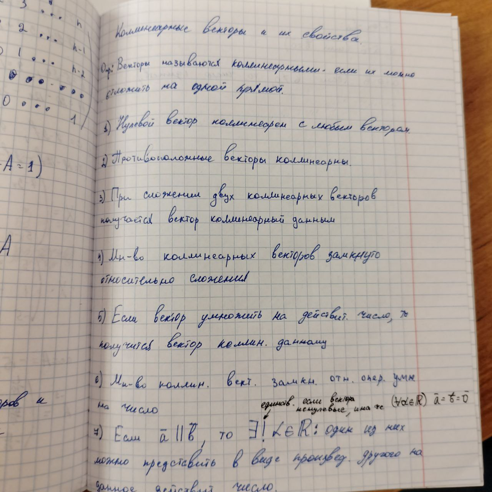
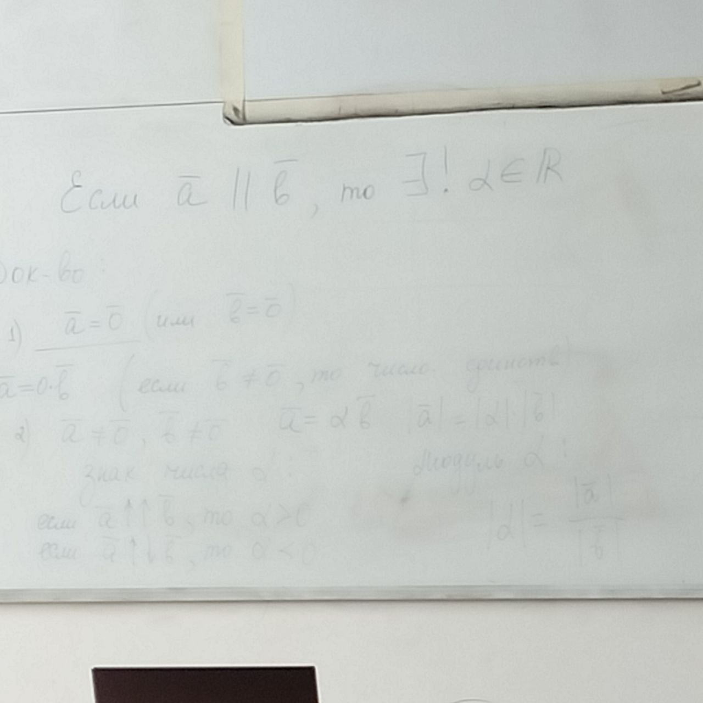

# Применение векторов

Спасибо Семёну за свойства!

8. **Признак коллинеарности векторов**: Два вектора коллинеарны тогда и только тогда, когда хотя бы один из них из них можно представить в виде произведения другого на действительное число
9. Если $\overline{a}$ ненулевой, то любой вектор, коллинеарный с вектором $\overline{a}$, то любой вектор можно представить в виде произведения $\overline{a}$ на любое действительное число, следовательно, для задания множества всех коллинеарных векторов достаточно задать один ненулевой вектор. На множестве векторов отношение коллинеарности - отношение эквивалентности.

# Компланарные векторы

**Определение**: векторы называются компланарными, если их можно отложить в одной плоскости.

Свойства:
1. Коллиниарные векторы компланарны
2. Сумма двух векторов - это вектор компланарный с ними
3. **Критерий компланарности трёх векторов**: три вектора компланарны тогда и только тогда, когда хотя бы один из них можно представить в виде линейной комбинации двух других. Линейная комбинация: $\{\overline{a_1},\overline{a_2},\dots,\overline{a_n}\}, \forall i = \overline{1,n}\quad \lambda_i\in\R\quad \lambda_1\overline{a_1}+\lambda_2\overline{a_2}+\dots+\lambda_n\overline{a_n}$ - линейная комбинация

Доказательство:

Дано: $\overline{c} =\alpha\overline{a}+\beta\overline{b} \Rightarrow (по 1 и 2 свойству) (\overline{a},\overline{b},\overline{c}) \Rightarrow (1) Пусть\ \overline{a} \parallel \overline{c},\ тогда\ \overline{c} = \alpha\overline{a}$

$\overline{OC} = \overline{OA_1}+\overline{OB_1} = \alpha \overline{a} + \beta\overline{b}$

4. Если векторы a и b коллинеарные, то любой компланарный с ними вектора можно представить в виде их линейной комбинации.

Доказательство единственности:

$\overline{a}\not\parallel\overline{b}, \overline{a},\overline{b},\overline{c}\ компланарны$

От противного:

$(1)\ \overline{c}=\alpha_1\overline{a}+\beta_1\overline{b}\\(2)\ \overline{c}=\alpha_2\overline{a}+\beta_2\overline{b}\\(\alpha_1\beta_1)\ne(\alpha_2\beta_2)\\\overline{0}=(\alpha_2-\alpha_1)\overline{a} + (\beta_2-\beta_1)\overline{b}\\\overline{b} = - \frac{\alpha_2-\alpha_1}{\beta_2-\beta_1}\overline{a} \Rightarrow \overline{a} \parallel \overline{b}$

**Определение**: Множество векторов называется линейным векторным пространством, если в нём определены две алгебраические операции сложения векторов и умножения вектора на действительное число, удовлетворяющие следующим требованиям.

1. Множество замкнуто относительно обеих операций
2. $\overline{a}+\overline{b}=\overline{b} + \overline{a}$
3. $(\overline{a}+\overline{b})+\overline{c}=\overline{a}+(\overline{b}+\overline{c})$
4. $\exists \overline{0}: \overline{a} +\overline{0} = \overline{a}$
5. $\exists (-\overline{a}): \overline{a}+(-\overline{a})=\overline{0}$
6. $1\cdot\overline{a}=\overline{a}$
7. $(\alpha\beta)\overline{a}=\alpha(\beta\overline{a})$
8. $(\alpha + \beta)\overline{a}=\alpha\overline{a}+\beta\overline{b}$
9. $\alpha(\overline{a}+\overline{b})=\alpha\overline{a}+\alpha\overline{b}$

### Примеры линейных пространств

1. Множество всех геометрических векторов
2. Множество всех комланарных векторов
3. Множество всех коллиниарных векторов
4. Множество из одного нулевого вектора
5. Множество всех матриц одного размера $m\times n$

$\{\overline{a_1},\overline{a_2},\dots,\overline{a_n}\}$

Система линейных векторов называется линейно независимой тогда и только тогда, когда комбинация этих векторов равна нулевому вектора, следовательно все коэффиценты одновременно нулевые

Линейно независимая $\Leftrightarrow \lambda_1\overline{a_1}+\lambda_2\overline{a_2}+\dots+\lambda_n\overline{a_n}=0 \Leftrightarrow \lambda_1=\lambda_2=\dots=\lambda_n$

Система векторов называется линейно зависимой, если существует ненулевой набор коэффицентов $
\lambda_1,\dots,\lambda_n$ такой, что линейная комбинация равна нулевому вектору.

Система векторов называется максимально линейно независимой системой, если сама она линейно независима, но при добавлении к ней любого другого вектора из данного пространства она становится линейно зависимой.