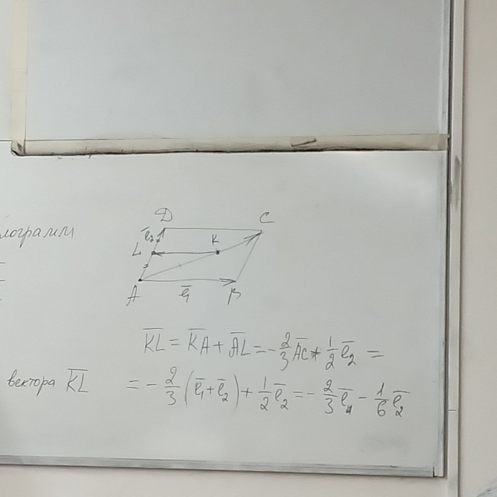
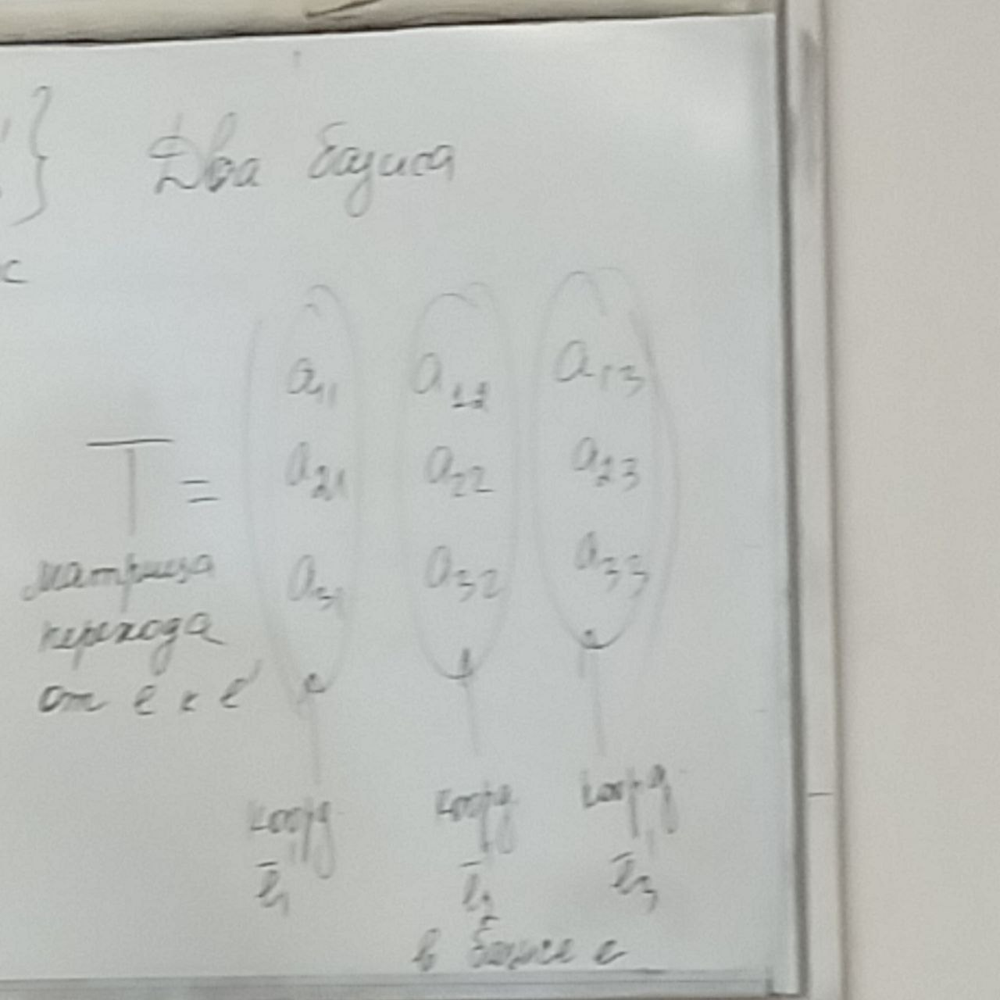

# Базис векторного пространства и координаты векторов базисе

**Определение**: Базисом векторного пространства называется любая упорядоченная максимальная линейно независимая система его векторов

Пусть $\overline{e_1},\overline{e_2},\overline{e_3}$ - максимально линейно независимая система

$\{\overline{e_1},\overline{e_2},\overline{e_3}\}$ и $\{\overline{e_3},\overline{e_1},\overline{e_2}\}$ - разные базисы

**Определение**: число векторов в базисе векторного пространства называется размерностью этого пространства

**Определение**: координатами вектора в данном базисе называется упорядоченный набор коэффицентов, с помощью которых этот вектор выражается через базисные векторы

$е = \{\overline{e_1},\overline{e_2},\overline{e_3}\}$ - матрица размера $1\times3$

$\overline{a} = X_1\overline{e_1}+X_2\overline{e_2}+X_3\overline{e_3}$

$$X=
\left( {\begin{array}{cc}
    X_1\\
    X_2\\
    X_3
  \end{array} } \right)
  =
  \left( {\begin{array}{cc}
    X_1 & X_2 & X_3
  \end{array} } \right)^T
$$

$\overline{a}=eX$

Пример:
ABCD - параллелограмм

$$
R: \overline{AK}=2\overline{KC}\\
L: \overline{AL}=\overline{LD}\\
e = \{\overline{AB}, \overline{AD}\}
$$

## Свойства координат вектора

1. В данном базисе каждый вектор имеет единственный набор координат

Доказательство:

$e=\{\overline{e_1},\overline{e_2},\overline{e_3}\}$

От противного:
$$
\overline{a} = x_1\overline{e_1}+x_2\overline{e_2}+x_3\overline{e_3}\ (1)\\
\overline{a} = y_1\overline{e_1}+y_2\overline{e_2}+y_3\overline{e_3}\ (2)\\
(1) - (2):\\
\overline{0} = (x_1-y_1)\overline{e_1}+(x_2-y_2)\overline{e_2}+(x_3-y_3)\overline{e_3}\\
x_i\ne x_y \textrm{ хотя бы одна из них}
$$

Получили нетривиальную линейную комбинацию базисных векторов, чего быть не может. Противоречие.

2. Если векторы заданы в одном и том же базисе, то при сложении векторов их соответствующие координаты складываются, при умножении вектора на действительное число на это число умножается каждая его координата

$$
\overline{a} = x_1\overline{e_1}+x_2\overline{e_2}+x_3\overline{e_3}\ (1)\\
\overline{b} = y_1\overline{e_1}+y_2\overline{e_2}+y_3\overline{e_3}\ (2)\\
\overline{a}+\overline{b} = (x_1\overline{e_1}+x_2\overline{e_2}+x_3\overline{e_3}) + (y_1\overline{e_1}+y_2\overline{e_2}+y_3\overline{e_3})=(x_1+y_1)\overline{e_1}+(x_2+y_2)\overline{e_2}+(x_3+y_3)\overline{e_3}
$$

3. Два вектора коллинеарны тогда и только тогда, когда их координаты в одном и том же базисе пропорциональны.
4. Три вектора компланарны тогда и только тогда, когда определитель, строчками которого являются координаты данных векторов, равен нулю.

## Матрицы переходы от одного базиса к другому, связь координат вектора в разных базисах

$е = \{\overline{e_1},\overline{e_2},\overline{e_3}\}\textrm{ старый базис }\quadе' = \{\overline{e_1}',\overline{e_2}',\overline{e_3}'\}\textrm{ новый базис}$

$$
\overline{e_1}' = a_{11}\overline{e}_1+a_{21}\overline{e}_2+a_{31}\overline{e}_3\\
\overline{e_2}' = a_{12}\overline{e}_1+a_{22}\overline{e}_2+a_{32}\overline{e}_3\\
\overline{e_1}' = a_{13}\overline{e}_1+a_{23}\overline{e}_2+a_{33}\overline{e}_3\\
T=
\left( {\begin{array}{cc}
    a_{11} & a_{12} & a_{13}\\
    a_{21} & a_{22} & a_{23}\\
    a_{31} & a_{32} & a_{33}
  \end{array} } \right)
$$

$e'=e\cdot T$

Итак, матрица $T$ - не вырожденная матрица

$$
a = e \cdot x=e'x'\\
x=
\left( {\begin{array}{cc}
    x_1\\
    x_2\\
    x_3
  \end{array} } \right)_e
\quad
x'=
\left( {\begin{array}{cc}
    x_1'\\
    x_2'\\
    x_3'
  \end{array} } \right)_{e'}\\
\overline{a} = x_1\overline{e_1}+x_2\overline{e_2}+x_3\overline{e_3}\\
\overline{a} = x_1'\overline{e_1}'+x_2'\overline{e_2}'+x_3'\overline{e_3}'\\
e\cdot x = (e\cdot T)\cdot x'\\
e\cdot x = e \cdot (T \cdot x')\\
\textrm{т.к. линейно независимая система}\\
x = T \cdot x'\\
x'=T^{-1}\cdot x
$$

# Скалярное произведение векторов
## Проекция на прямую параллельна данной плоскости

Дана: $l(прямая), \pi(плоскость), l \not\parallel \pi$

Пусть точка M произвольная точка пространства, через точку M проведём точку $\pi'$ параллельную плоскости $\pi$. $l$ пересекает $\pi'$ в точке $M'$. Точка $M'$ называется проекция точки $M$ на прямую $l$ плоскости $\pi$

### Свойства проекций
1. Каждая точка имеет проекцию и только одну
2. Точка совпадает тогда и только тогда, когда она лежит на прямой $l$
3. Точки имеют одну и ту же проекцию тогда и только тогда, когда они лежат в одной плоскости, параллельной $\pi$
4. Если отрезок параллелен плоскости $\pi$, то он проектируется в точку. Если отрезок не параллелен плоскости $\pi$, то он проектируется в отрезок
5. Проекция ориентированного отрезка является ориентированным отрезком, следовательно, проекцией вектора будет вектор (в том числе и нулевой). И этот вектор называется вектороной проекцией данного вектора $\overline{np_e}\overline{a}$ (плоскость $\pi$)
6. Равные и параллельные отрезки имеют равные проекциии
7. Если векторы равны, то их векторные проекции также равны ($\overline{np_e}(\overline{a}+\overline{b})=\overline{np_e}\overline{a}+\overline{np_e}\overline{b}$)
8. $\overline{np_e}(\alpha\overline{a})=\alpha\overline{np_e}\overline{a}$