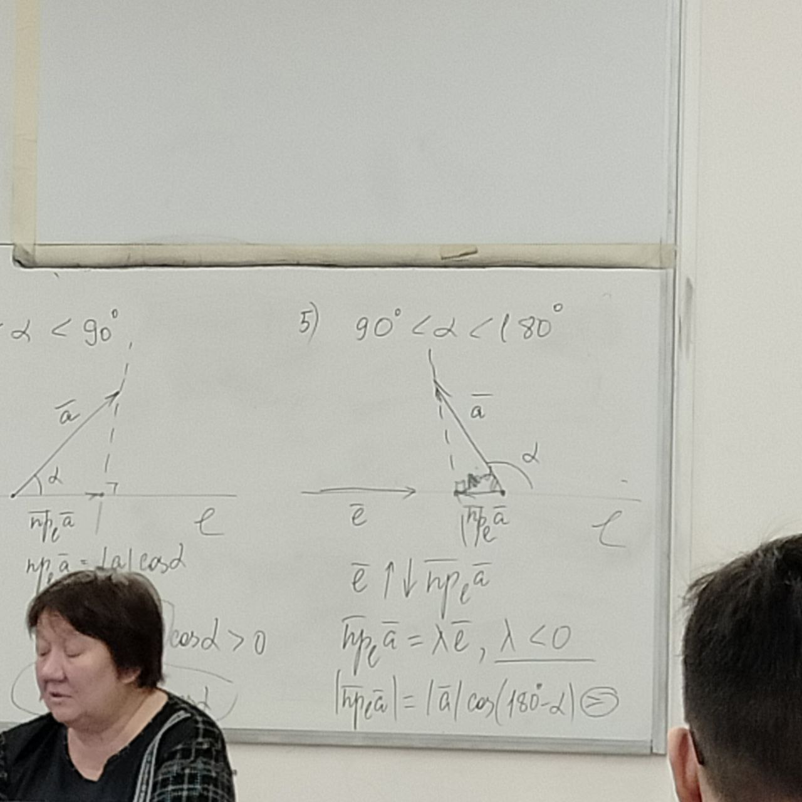

# Проекция

Осья называется прямая с фиксированным на ней единичным вектором

Единичный вектор **Орт**

$A_1=np_eA$ (параллельно A)

$B_1=np_eB$ (парллельно B)

$\overline{A_1B_1}=\alpha\overline{e}$

Число $\alpha$ называется числовой проекцией вектора $\overline{a}$

Числовая проекция вектора на ось сохраняет сумму векторов и произведение вектора на число.

## Ортогональная проекция вектора на ось

Проектирование называется ортогональным, если плоскость $\pi$ ортогональна оси.

При ортогональном проектировании достаточно из данной точки опустить на ось перпендикуляр.

Числовая ортогональная проекция вектора на ось равна произведению длины этого вектора на косинус угла между данным вектором и осью.

1. $\alpha = 0$

2. $\alpha = 180$

3. $\alpha = 90$

4. $0 <\alpha < 90$

5. $90 < \alpha < 180$

# Скалярное произведение
Скалярным произведением упорядоченной пары ненулевых векторов называется число, равное произведению длин этих векторов на косинус угла между ними. Если хотя бы один из множителей нулевой вектор, то скалярное произведение считается равным нулю. $\overline{a}\cdot\overline{b}$ или $(\overline{a},\overline{b})$

## Свойства скалярного произведения
1. Скалярное произведение любой упорядоченной пары векторов определно и однозначно
2. Коммутативность
3. Для любых векторов $\overline{a}$ и $\overline{b}$: $\overline{a}\cdot\overline{b} = |\overline{a}|np_{\overline{a}}\overline{b}$ (при ортогональном проектировании)
4. Скалярное произведение векторов равно нулю тогда и только тогда, когда либо один из векторов нулевой, либо векторы перпендикулярны
5. Скалярное произведение векторов дистрибутивно относительно сложения векторов: $(\overline{a}+\overline{b})\cdot\overline{c} = |\overline{c}|np_{\overline{c}}(\overline{a}+\overline{b}) = |\overline{c}|np_{\overline{c}}(\overline{b}+\overline{a})=\overline{a}\overline{c}+\overline{b}\overline{c}$
6. Вынесение числового множителя за знак скалярного произведения. $(\alpha\overline{a})\cdot\overline{b}=np_{\overline{b}}\alpha\overline{a}=\alpha np_{\overline{b}}\overline{a}=\alpha(\overline{a}\cdot\overline{b})$
7. Скалярный квадрат вектора $\overline{a}$ равен квадрату его длины. $\overline{a}\cdot\overline{a}=\overline{a}^2=|a|^2$ $|a| = \sqrt{\overline{a}^2}$.
8. $\cos(\overline{a};\overline{b})=\frac{\overline{a}\cdot\overline{b}}{|\overline{a}|\cdot|\overline{b}|}$ 

# Скалярное произведение в координатах

$e=\{\overline{e_1},\overline{e_2},\overline{e_3}\}$ - базис

$\overline{a}=\{x_1,y_1,z_1\}^T=x_1 \overline{e_1} + y_1 \overline{e_2} + z_3 \overline{e_3} = e \cdot X_a$

$\overline{b}=\{x_2,y_2,z_2\}^T = x_2 \overline{e_1} + y_2 \overline{e_2} + z_2 \overline{e_3} = e X_b$

$X_a\ и\ X_b$ - транспонирование a и b

## Матрица Грама

Матрица линейного пространства, у которой элемент, стоящий в i-ой строке и j-ом столбце равен скалярному произведению i-ого и j-ого базисных векторов.

$$\Gamma(e)=
\left( {\begin{array}{cc}
    \overline{e_1}\cdot\overline{e_1} & \overline{e_1}\cdot\overline{e_2} & \overline{e_1}\cdot\overline{e_3}\\
    \overline{e_2}\cdot\overline{e_1} & \overline{e_2}\cdot\overline{e_2} & \overline{e_2}\cdot\overline{e_3}\\
    \overline{e_3}\cdot\overline{e_1} & \overline{e_3}\cdot\overline{e_2} & \overline{e_3}\cdot\overline{e_3}\\
  \end{array} } \right)
$$

$\overline{a}\cdot\overline{b}=X_a^T\Gamma X_b$

$\overline{a}\cdot \overline{b} = \left( {\begin{array}{cc}
    x_1 & y_1 & z_1
  \end{array} } \right)\Gamma\left( {\begin{array}{cc}
    x_2\\
    y_2\\
    z_2
  \end{array} } \right)$

$\overline{a}\cdot\overline{b}=(x_1\overline{e_1}+y_1\overline{e_2}+z_1\overline{e_3})\cdot(x_2\overline{e_1}+y_2\overline{e_2}+z_2\overline{e_3}) = x_1x_2\overline{e_1}^2+(x_1y_2+y_1x_2)\overline{e_1}\cdot\overline{e_2}+(y_1z_2+z_1x_2)\overline{e_1}\overline{e_3}+y_1y_2\overline{e_2}^2+z_1z_2\overline{e_3}^2$

Если базис ортонормированный: $B=\{\overline{i}, \overline{j},\overline{k}\}\quad |\overline{i}|=|\overline{j}|=|\overline{k}|$ Они все перпендикулярны.

Матрица Грама в ортонормированом базисе единичная: $\overline{a}\cdot\overline{b}=x_1x_2+y_1y_2 + z_1z_2$