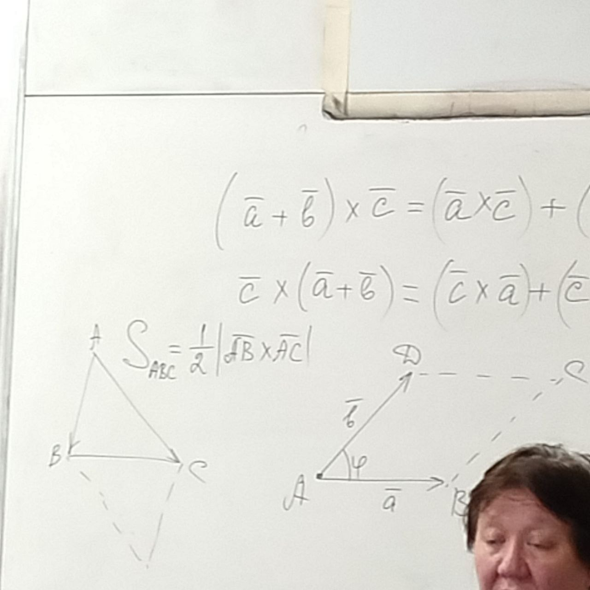
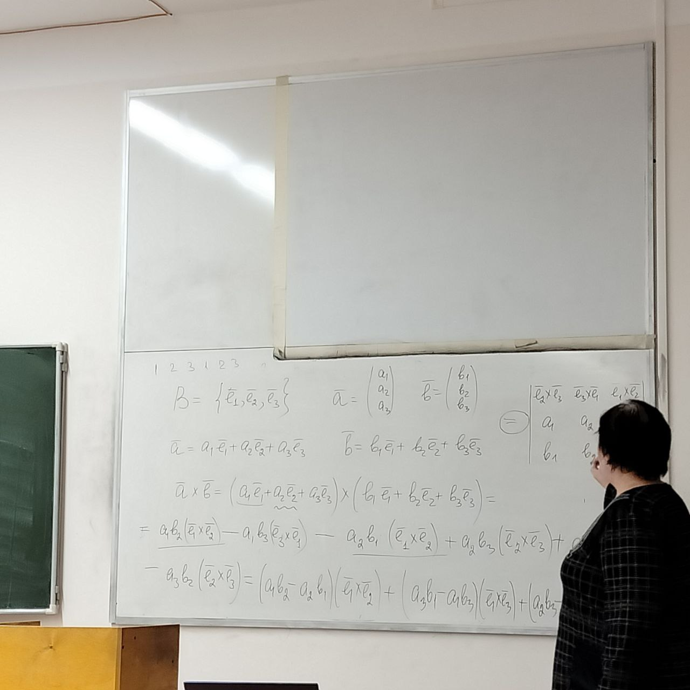

# Векторное произведение

**Определение**: Упорядоченная тройка некомпланарных векторов $\overline{a},\overline{b},\overline{c}$ называется **положительно ориентированной (правой)**, если при откладывании этих векторов от одной точки кратчайший поворот от вектора $\overline{a}$ к вектору $\overline{b}$ с конца вектора $\overline{c}$ виден против часовой стрелки. В противном случае данная тройка векторов называется **отрицательно ориентированной (левой)**.

$\overline{a} \times \overline{b} = [\overline{a}, \overline{b}]$ - векторное произведение

$\overline{a} \not\parallel \overline{b}: \overline{a}\times\overline{b} = \overline{c}$

1. $|\overline{c}|=|\overline{a}|\cdot|\overline{b}|\cdot\sin\phi$
2. $\overline{c} \perp \overline{a}, \overline{c} \perp \overline{b}\quad\overline{a},\overline{b},\overline{c}$ положительно ориентированные

$\overline{a} \parallel \overline{b}: \overline{a}\times\overline{b} = 0$

## Свойства векторного произведения векторов

1. Векторное произведение любой упорядоченной пары векторов определено и однозначно
2. Векторное произведение **антикоммутативно**: $\forall\overline{a}, \overline{b} \in V \quad \overline{a}\times\overline{b}=-(\overline{b}\times\overline{a})$
3. Числовой множитель можно выносить за знак векторного произведения $\forall \alpha \in \R\quad \forall\overline{a}, \overline{b} \in V\quad(\alpha\overline{a})\times\overline{b} = \overline{a}\times(\alpha\overline{b}) = \alpha(\overline{a}\times\overline{b})$
4. Векторное произведение дистрибутивно относительно сложения векторов $(\overline{a}+\overline{b})\times\overline{c}=(\overline{a}\times\overline{c})+(\overline{b}\times\overline{c})=\overline{c}\times(\overline{a}+\overline{b})$

**Замечание**: Векторное произведение **не обладает** свойством ассоциативности

5. Векторное произведение равно нулю тогда и только тогда, когда векторы коллиниарны
6. Геометрический смысл векторного произведения: если векторы $\overline{a}$ и $\overline{b}$ не коллиниарны, то длина векторного произведения численно равна площади параллелограмма, построенного на этих векторах как на сторонах.

7. Выражение векторного произведения в координатах:

$$
  \overline{a}\times\overline{b} =
  \left| {\begin{array}{cc}
    \overline{e_2}\times\overline{e_3} & \overline{e_3}\times\overline{e_1} & \overline{e_1}\times\overline{e_2} \\
    a_{1} & a_{2} & a_{3} \\
    b_{1} & b_{2} & b_{3}
  \end{array} } \right|
$$

$$
\overline{i}\times\overline{j} = \overline{k}\\
\overline{i}\times\overline{k} = \overline{j}\\
\overline{k}\times\overline{j} = \overline{i}\\
\overline{a}\times\overline{b} =
  \left| {\begin{array}{cc}
    \overline{i} & \overline{j} & \overline{k} \\
    a_{1} & a_{2} & a_{3} \\
    b_{1} & b_{2} & b_{3}
  \end{array} } \right|
$$

## Применение векторного произведения для решения задач
1. Для нахождения коллиниарности векторов
2. Для нахождения направления, перпендикулярного данной плоскости
3. Для нахождения площадей параллелограмма, треугольника и других многоугольников