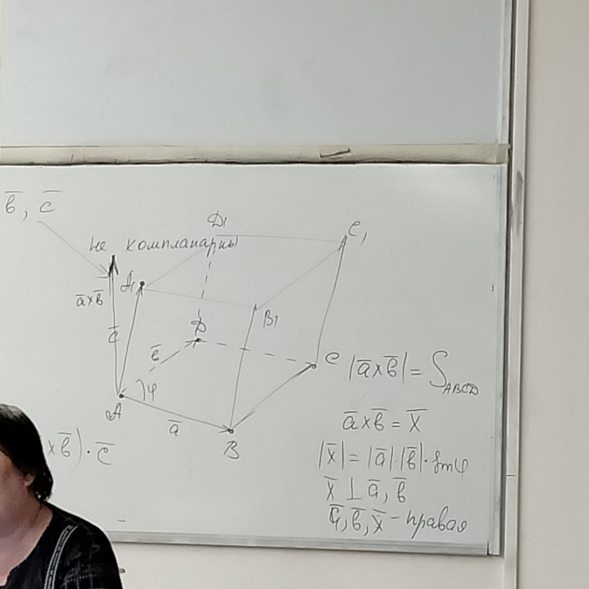
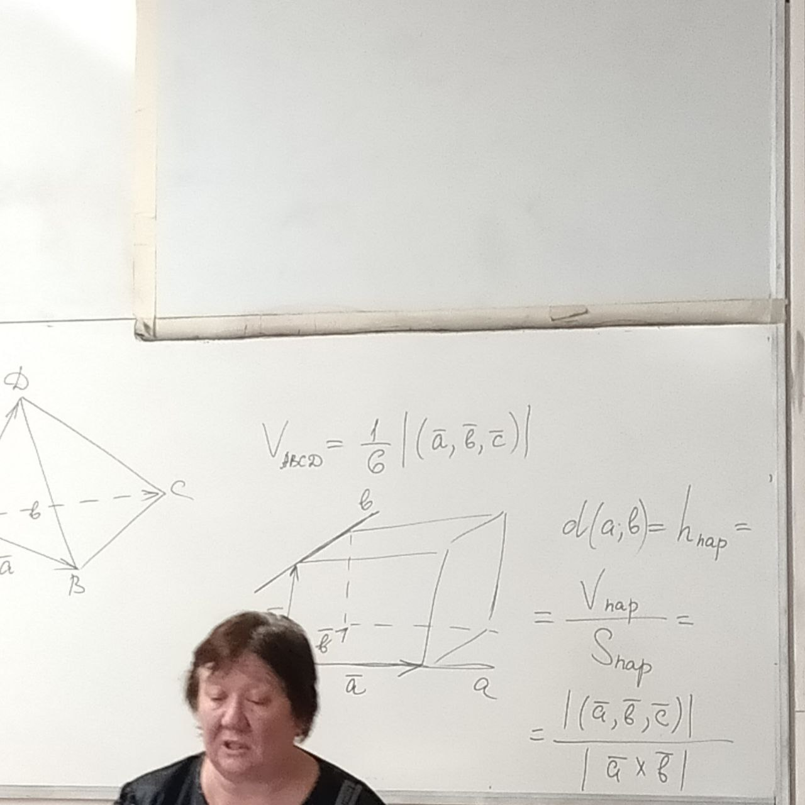

# Смешанное произведение

**Определение**: *Смешанным произведением* упорядоченной тройки векторов называется результат векторного произведения первых двух векторов, умноженный скалярно на третий вектор.

$(\overline{a}, \overline{b}, \overline{c}) = (\overline{a}\times\overline{b})\cdot\overline{c}$

## Свойства

1. Смешанное произведение определено и однозначно

2. Дистрибутивность

3. Можно вынести числовые коэффиценты

4. Вычисление смешанного произвдения в координатах относительно ортонормированного базиса.

$$B=\{\overline{i},\overline{j},\overline{k}\}\\

\overline{a}=\left({\begin{array}{cc}
    a_1\\
    a_2\\
    a_3
\end{array}
}\right)\quad
\overline{b}=\left({\begin{array}{cc}
    b_1\\
    b_2\\
    b_3
\end{array}
}\right)\quad
\overline{c}=\left({\begin{array}{cc}
    c_1\\
    c_2\\
    c_3
\end{array}
}\right)\\

\overline{a}\times\overline{b} =
  \left| {\begin{array}{cc}
    \overline{i} & \overline{j} & \overline{k} \\
    a_{1} & a_{2} & a_{3} \\
    b_{1} & b_{2} & b_{3}
  \end{array} } \right|\\

(\overline{a}\times\overline{b})\cdot\overline{c}=(
\left| {\begin{array}{cc}
    a_{2} & a_{3} \\
    b_{2} & b_{3}
\end{array} } \right|
-\left| {\begin{array}{cc}
    a_{1} & a_{3} \\
    b_{1} & b_{3}
\end{array} } \right|
+
\left| {\begin{array}{cc}
    a_{1} & a_{2} \\
    b_{1} & b_{2}
\end{array} } \right|
)\cdot\Gamma\cdot\left( {\begin{array}{cc}
    c_1\\
    c_2\\
    c_3\\
\end{array} } \right)
= ... = \left| {\begin{array}{cc}
    a_{1} & a_{2} & a_3 \\
    b_{1} & b_{2} & b_{3}\\
    c_{1} & c_{2} & c_{3}
\end{array} } \right|
$$

5. Смешанное произведение не изменится, если в нём поменять знаки векторного и скалярного произведения

$(\overline{a}\times\overline{b})\cdot\overline{c}=\overline{a}\cdot(\overline{b}\times\overline{c})$

$$
\left| {\begin{array}{cc}
    a_{1} & a_{2} & a_3 \\
    b_{1} & b_{2} & b_{3}\\
    c_{1} & c_{2} & c_{3}
\end{array} } \right| = 
\left| {\begin{array}{cc}
    b_{1} & b_{2} & b_{3}\\
    c_{1} & c_{2} & c_{3}\\
    a_{1} & a_{2} & a_3
\end{array} } \right|
$$

6. Если в смешанном произведении все множители поменять местами, то смешанное произведение не изменится. $(\overline{a},\overline{c},\overline{b})=-(\overline{a}, \overline{b}, \overline{c})$

7. Смешанное произведение трёх векторов равно нулю тогда и только тогда, когда данные векторы компланарны

$$
(\overline{a}\times\overline{b})\cdot\overline{c}=0
\Leftrightarrow
\begin{equation}
\left[ \begin{aligned} 
  \overline{a}\times\overline{b}=0 \Rightarrow \overline{a} \parallel \overline{b}\ компланарны\\
  \overline{c} = 0\Rightarrow (\overline{a}, \overline{b}, 0)\ компланарны\\
  \overline{a}, \overline{b} \perp \overline{c} \Rightarrow ...\ компланарны
\end{aligned} \right.
\end{equation}
$$

8. Смешанное произведение относительно произвольного базиса

$$
B=(\overline{e_1},\overline{e_2},\overline{e_3})\\
\overline{a}=(a_1,a_2,a_3)^T\\
\overline{b}=(b_1,b_2,b_3)^T\\
\overline{c}=(c_1,c_2,c_3)^T\\

(\overline{a}\times\overline{b})\cdot\overline{c}=\left| {\begin{array}{cc}
    a_{1} & a_{2} & a_3 \\
    b_{1} & b_{2} & b_{3}\\
    c_{1} & c_{2} & c_{3}
\end{array} } \right|\
\cdot
(\overline{e_1},\overline{e_2},\overline{e_3})
$$

9. Критерий компланарности трёх векторов

Три векторы компланарны тогда и только тогда, когда их *смешанное произведение равно нулю*, а это будет тогда и только тогда, когда *определитель*, составленный из координат этих векторов любого базиса, *равен нулю*

10. Геометрический смысл модуля и знака смешанного произведения трёх векторов.
  - Компланарны $\Rightarrow (\overline{a},\overline{b},\overline{c})=0$
  - Не комланарны

Если тройка векторов a,b,c не компланарна, то смешанное произведение трёх векторов положительно тогда и только тогда, когда тройка векторов правая или положительно определённая.

Модуль смешанного произведения трёх векторов численно равен объёму параллелопипеда, построенного на этих векторах.

# Метод координат на плоскости и в пространстве

**Аффинная система система координат**

### На плоскости

$R = \{O, \overline{e_1}, \overline{e_2}\}$ - репер

Условие: не коллинеарны

### В пространстве
$R = \{O, \overline{e_1}, \overline{e_2}, \overline{e_3}\}$

Условие: не компланарны

Координатами точки относительно данной системы координат называется упорядоченный набор коэффицентов в разложении радиус-вектора этой точки по базисным векторам.

Задачи:
- Связь координат вектора и координат его концов
- Координаты середины отрезка (равны полусумме координат концов этого отрезка)
- Деление отрезков в данном отношении