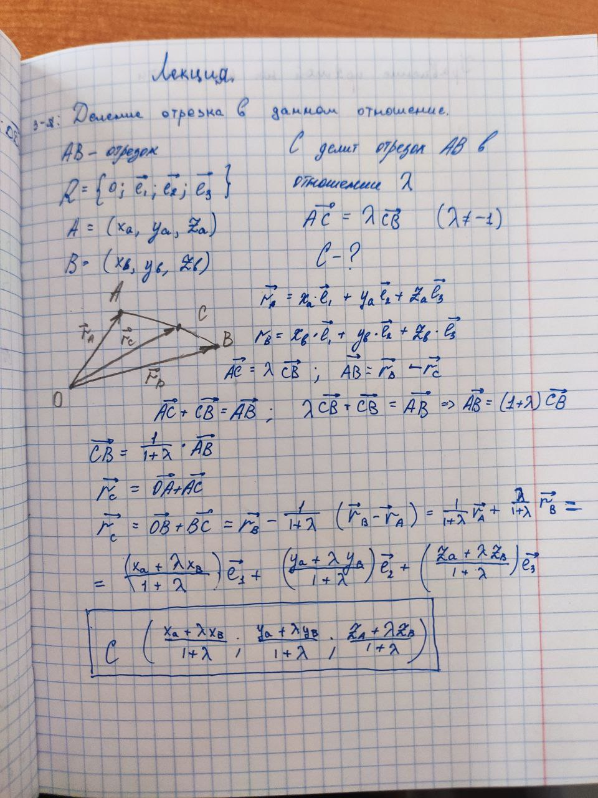
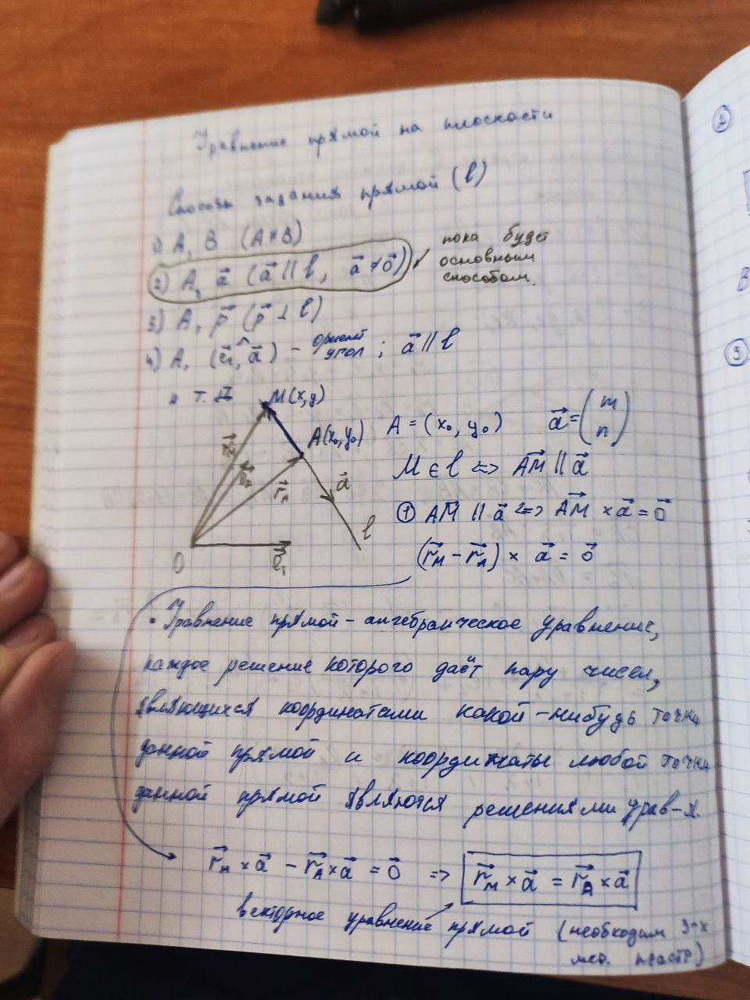
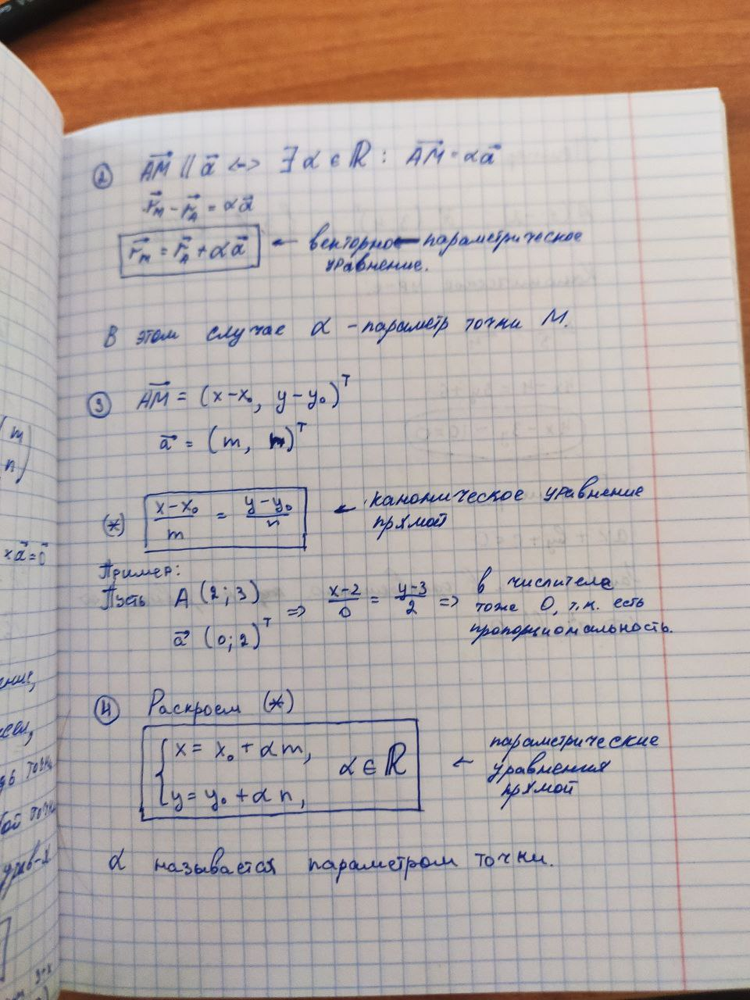
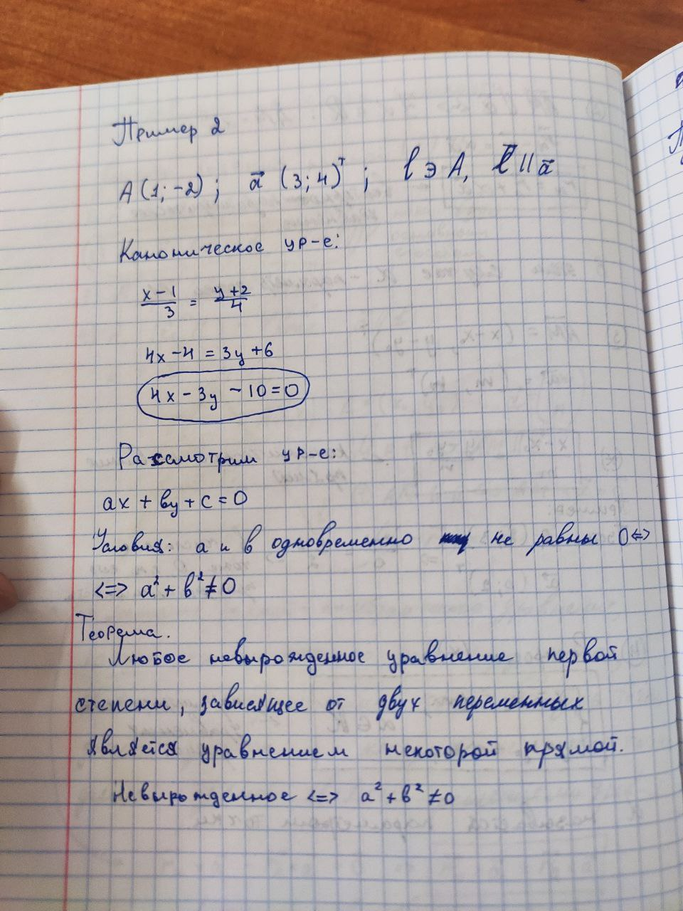
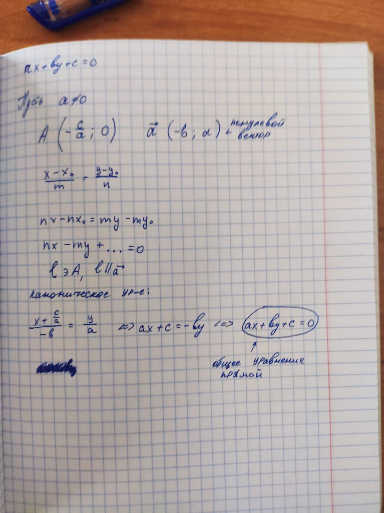

# Уравнение прямой на плоскости

Уравнение прямой - это алгебраическое уравнение, каждое решение которого даёт пару чисел, являющимися координатами точек данной прямой, и координаты любой точки этой прямой являются решениями этого уравнения.

