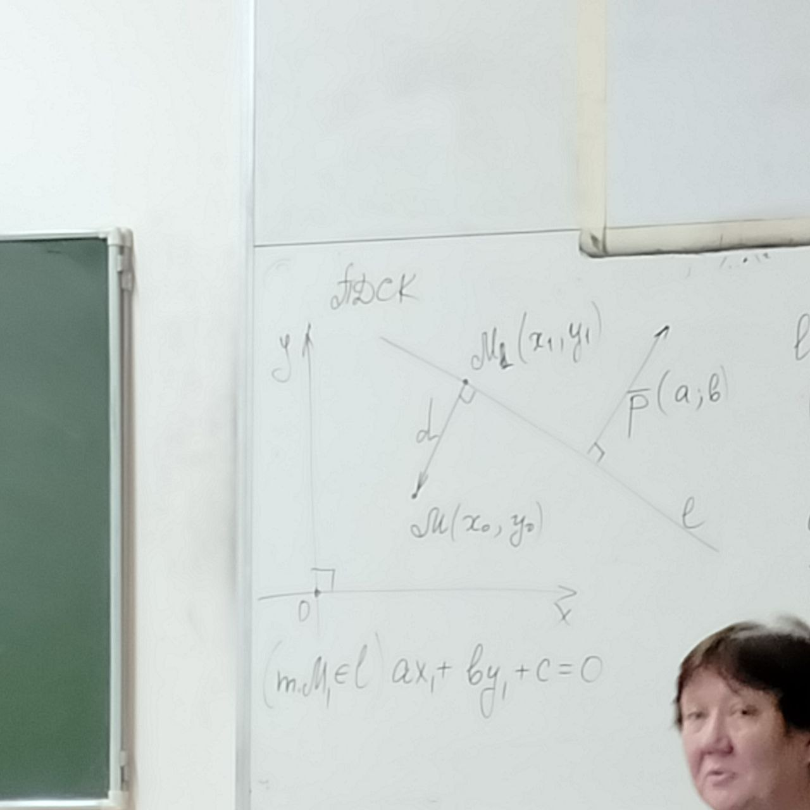

# Прямая на плоскости в декартовой системе координат

Уравнения:
- векторные
- пространственные уравнения
- канонические уравнения
- общее уравнение
- уравнения с угловым коэфицентом

$$
ax+by+c=0\ \Rightarrow b \ne 0\\
y = -\frac{a}{b}x-\frac{c}{a}
$$

- Уравнение в "отрезках"

$$
\frac{x-a}{-a}=\frac{y-0}{b}\\
\frac{x}{a}+\frac{y}{b}=1
$$

## Свойства

В прямоугольной декартовой системе координат (ПДСК)
$$
l: ax+by+c=0\\
(a^2+b^2\ne0)
\textrm{в аффинной системе координат - направляющий вектор}\\
\overline{m}=(-b;a)
$$

В ПДСК $\overline{p}(a;b)\perp l$

$\overline{m} \cdot\overline{p}=-b\cdot a+a\cdot b =0$

## Применение уравнения прямой к решению задач

Аффинная система координат
$$
l_1: a_1x+b_1y+c_1=0\quad l_2: a_2x+b_2y+c_2=0\\
\textrm{Направляющий вектор}: \overline{m_1}(-b_1,a_1)\quad \overline{m_2}(-b_2, a_2)\\
\frac{a_1}{a_2}=\frac{b_1}{b_2} ?\\

\textrm{Если да, то либо парллельные, либо совпадают}\\
\frac{a_1}{a_2}=\frac{b_1}{b_2}=\frac{c_1}{c_2}?\\
\textrm{Если да, совпадают, иначе параллельны}
\textrm{Если нет, прямые пересекаются}\\
\begin{cases}
    a_1x+b_1y+c_1=0\\
    a_2x+b_2y+c_2=0
\end{cases}
$$

1. Вычисление угла между прямыми

$$
l_1: a_1x+b_1y+c_1=0\quad\overline{m_1}(-b_1,a_1)\\
l_2: a_2x+b_2y+c_2=0\quad\overline{m_2}(-b_2,a_2)\\
\cos{\phi}=\frac{\overline{m_1}\cdot\overline{m_2}}{|\overline{m_1}|\cdot|\overline{m_2}|}=\frac{a_1a_2+b_1b_2}{\sqrt{a_1^2+b_1^2}\cdot\sqrt{a_2^2+b_2^2}}\\\ \\
\cos (\widehat{l_1, l_2})=|\cos{\phi}|=\frac{|a_1a_2+b_1b_2|}{\sqrt{a_1^2+b_1^2}\cdot\sqrt{a_2^2+b_2^2}}
$$

Углом между прямыми называется острый угол, который образован при их пересечении.

2. Критерий перпендикулярности прямых

$$
l_1\perp l_2 \Leftrightarrow a_1a_2 + b_1b_2 = 0
$$

3. Расстояние от точки до прямой

$$
l: ax+by+c=0\quad (a^2+b^2\ne0)\\
d(M, l) = d\\
\overline{p}(a;b) \perp l
\overline{M_1M}\perp l

\Rightarrow \overline{p} \parallel \overline{M_1M}
$$

$$
\overline{p}\cdot\overline{M_1M} = |\overline{p}||\overline{M_1M}|\cos\phi=\pm\sqrt{a^2+b^2}\cdot d\\
\overline{M_1M} = (x_0-x_1, y_0-y_1)\\
\overline{p}\cdot \overline{M_1M} = a(x_0-x_1)+b(y_0-y_1)=(ax_0+by_0)-(ax_1+by_1)=ax_0+by_0+c\\
\pm\sqrt{a^2+b^2}\cdot d = ax_0+by_0+c\\
\sqrt{a^2+b^2}\cdot d =|ax_0+by_0+c|\\
\fcolorbox{red}{f}{$d(M, l)=\frac{|ax_0+by_0+c|}{\sqrt{a^2+b^2}}$}
$$

# Уравнение плоскостей

1. Три точки, не лежащие на одной прямой (общего положения)
2. Две пересекающиеся прямые
3. Прямая и не лежащая на ней точка
4. Две параллельные прямые
5. Точка и перпендикуляр к данной плоскости
6. Два некомпланарных вектора
...

Аффинная система координат $B=\{0;\overline{e_1},\overline{e_2},\overline{e_3}\}$

$$
A(x_0,y_0,z_0)\\
\overline{u}(m_1,n_1,p_1)\\
\overline{v}(m_2,n_2,p_2)
$$

Точка $M$ принадлежит плоскости $p$ тогда и только тогда, когда векторы $\overline{u}, \overline{v}, \overline{AM}$ компланарны.

$(\overline{AM}, \overline{u}, \overline{v})=0$

$$\exists \alpha, \beta \in \R\\ \overline{AM} = \alpha\overline{u} + \beta\overline{v}$$

$$\fcolorbox{box}{t}{$\overline{r_M}=\overline{r_A}+\alpha\overline{u}+\beta\overline{\beta}$}$$

$$(\overline{r_M}, \overline{u}, \overline{v})=(\overline{r_A},\overline{u},\overline{v})$$