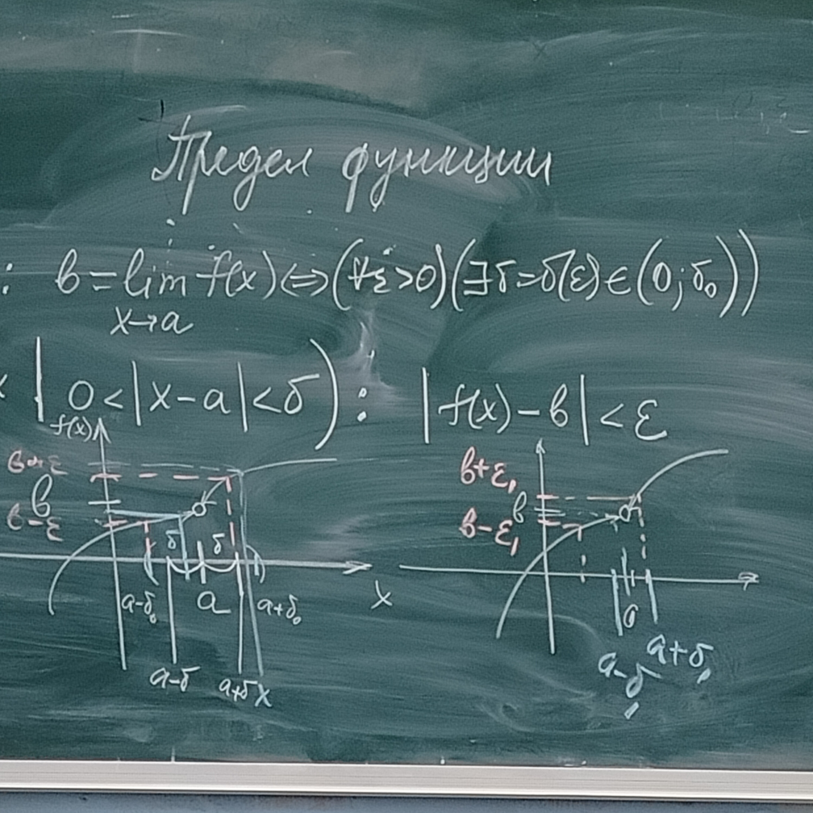
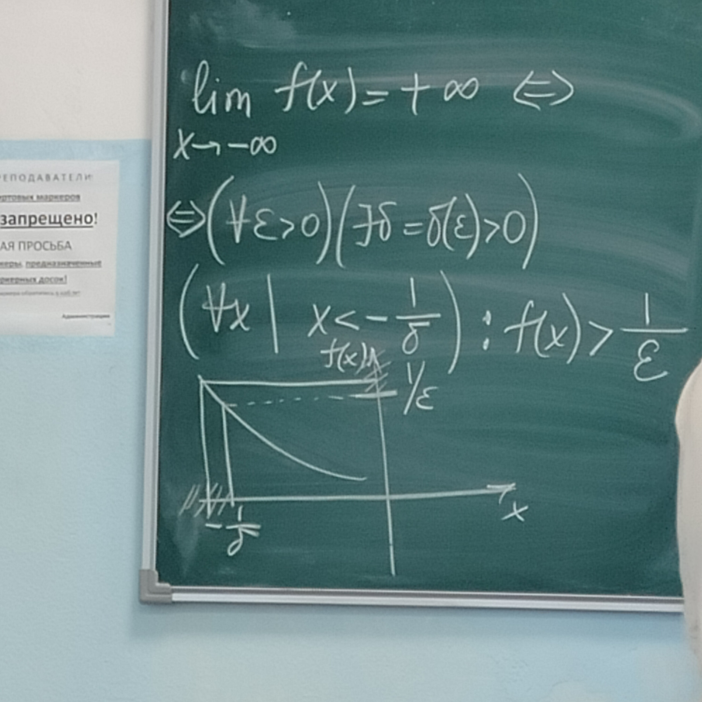
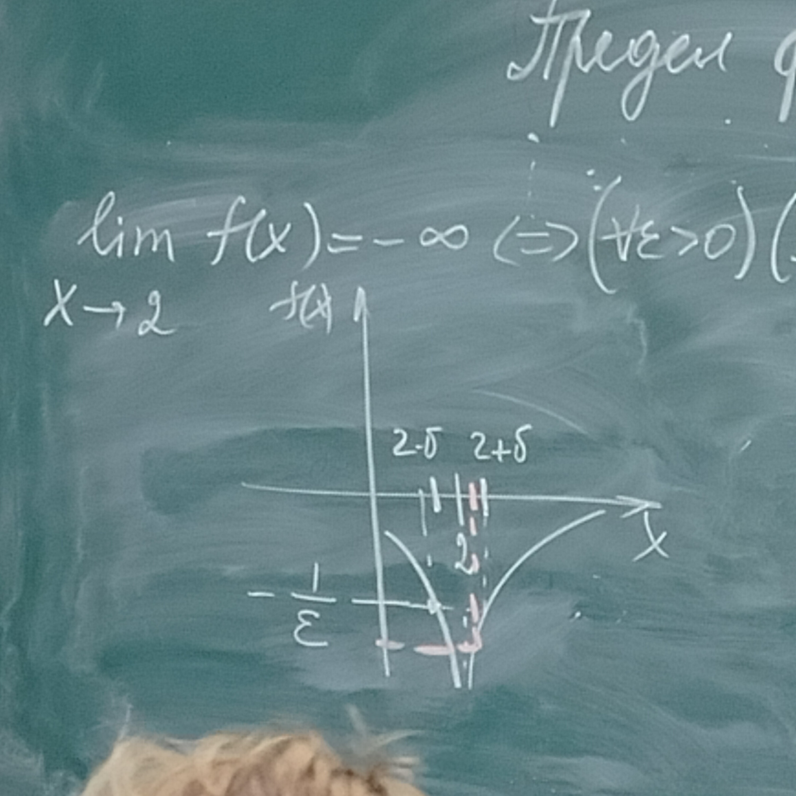

# Функции

$f : X \to Y$ - зависимость, которая ставит в соответствие $\forall x \in X \exists! y \in Y$ (функция)

$X \ni x$ - аргумент, независимая переменная, $X$ - область определения функции

$y_f = \{y : f(x) = y, x \in X\} \subseteq Y$ - множество(область) значений функции

$y=f(x), x\in X$

$X$ - область допустимых значений уравнения $y=f(x)$

$f(x)$ - значение функции в точке $x$; $f$ - функция, $f(x)$ - функция (из контекста)

$f_1^{(x)}=f_2^{(x)} \Leftrightarrow$
1. Область определения одна
2. $\forall x \in X : f_1(x)=f_2(x)$

$E \subset X \quad f(E) = \{y: f(x)=y, x\in E\}$ - сужение функции на множество $E$

Пример:
$y=\sin x, x \in \R;\quad y=\sin x \in [-\frac{\pi}{2};\frac{\pi}{2}]$

$X, Y \subseteq \R \Rightarrow f$ - числовая функция

## Граифк фукнции

$\Gamma = \{(x, f(x): x \in X\}$

Способы задания функции:
1. Графический - т.е. на плоскости $xOy$ - линия $L$: $(x, f(x)) \in L$ (для любой функции можно построить график, но не для любого графика можно задать функцию)

$$
\textrm{Функция Дирихле:}\\
\chi(x) = 
\begin{equation}
    \begin{cases}
      0, x \in I\\
      1, x \in Q
    \end{cases}\,
\end{equation}
$$ 

2. Дискретный (таблица)
3. Аналитический (формулы)
$$
\textrm{Например, } y=\cos^3\sqrt{e^x-1}\textrm{ - явное задание функции}
$$
4. Неявное задание функции уравнением $F(x,y)=0$ задаёт функцию $y=f(x) \Leftrightarrow F(x, f(x))=0$

Невсегда любое уравнение задаёт функцию ($\forall F = 0 \quad \exists Y$). Например, $|x|+|y|+1=0$

5. Параметрическая функция
$$
\begin{equation}
    \begin{cases}
      x = \phi(t)\\
      y = \psi(t)
    \end{cases}\,
\end{equation}
\quad t \in [\alpha,\beta] (T) \to y = f(x), x \in \phi(T)
$$

## Элементарные функции
1. Степенные функции $y = x^{\alpha};\quad x^{\frac{1}{3}} = \sqrt[3]{x}, x\in R$
2. Показательные $y=a^x, a > 0, x \in \R$
3. Логарифмические $y=\log_a x, a > 0, a \ne 1, x \in (0;+\infty)$
4. Тригонометрические $y = \sin x, x \in R$
5. Обратные тригонометрические $y = \arcsin x, x \in [-1,1]$

**Определение**: $y=f(x)$ - элементарная функция $\Leftrightarrow$ она составлена из основных элементарных функций путём конечного числа арифметических действий и суперпозиций (композиций)

Суперпозиция(композиция) - $(f\circ g) = f(g(x))$

$x \in E, g(x) \in G$

$f$ определена на $G \Rightarrow y = f(g(x))$ определена на $E$

## Предел функции

$\cup_{\epsilon}(a) = (a - \epsilon, a + \epsilon)$

$\cup_{\epsilon}^{\circ}(a) = (a - \epsilon, a + \epsilon) \ \{a\}$

$\cup_{\epsilon}(+\infty) = (\frac{1}{\epsilon};+\infty),\quad \cup_E(+\infty)=(E;+\infty)$

$\cup_{\epsilon}(-\infty)=(-\infty;-\frac{1}{\epsilon})$

Пусть $a \in \R,\quad \exists \delta_0>0 : \forall x \in \cup^{\circ}_{\delta_0}(a)\  \exists f(x)$

$$\overline \R \ni b = \displaystyle\lim_{x\to a} f(x) \quad (f(x) \to b\ при\ x \to a)$$

**Определение предела**: $(\forall \epsilon > 0)(\exists \delta = \delta(\epsilon) \in (0, \delta_0)) : (\forall x \in \cup^{\circ}_{\delta}(a) \to f(x) \in \cup_{\epsilon}(b))$ (определение по Коши (на языке "$\epsilon - \delta$"))

$a, b \in \R: b = \displaystyle\lim_{x\to a}f(x) \Leftrightarrow (\forall \epsilon > 0)(\exists \delta = \delta(\epsilon) \in (0;\delta_0))$

$(\forall x | 0 < |x-a|< \delta): |f(x) - b| < \epsilon$

$\displaystyle\lim_{x\to-\infty}f(x)=+\infty \Leftrightarrow (\forall \epsilon > 0)(\exists \delta = \delta (\epsilon) > 0)(\forall x | x < -\frac{1}{\delta}): f(x) > \frac{1}{\epsilon}$

$\displaystyle\lim_{x\to2}f(x)=-\infty \Leftrightarrow (\forall \epsilon > 0)(\exists \delta = \delta (\epsilon) > 0)(\forall x |0 < |x-2| < \delta): f(x) < - \frac{1}{\epsilon}$

**Определение**: $\{x_n\}$ - последовательность Гейне в $\cup(a)$
1. $\forall n \in \N \to x_n \in \cup^{\circ}(a)$
2. $\{x_n\} \to a\ при\ n \to \infty$

**Определение предела** (по Гейне, на языке последовательностей): $\overline \R \ni b = \displaystyle\lim_{x\to a}f(x) \Leftrightarrow \forall \{x_n\} - \textrm{последовательность Гейне} \to \{f(x_n)\} \to b\ при\ n \to \infty \Leftrightarrow \forall \{x_n\} | \displaystyle\lim_{n\to\infty}x_n=a,\ x_n\ne a,\  \forall n \in \N\to\lim_{n\to\infty}f(x_n)=b$

**Теорема(эквивалентность определений пределов)**:

$y=f(x) \ определена\ в\ \cup_{\delta_0}^{\circ}(a), a, b \in \overline \R, b = \displaystyle\lim_{x\to a}f(x) \Rightarrow \textrm{утверждения } \forall \epsilon (1)\ и\ \forall \delta(2) \textrm{ эквивалентны}$

*Доказательство $(1) \to (2)$*:

$(\forall \epsilon > 0)(\exists \delta = \delta(\epsilon)\in (0;\delta_0))(\forall x \in \cup_\delta^\circ(a)\to f(x) \in \cup_\epsilon(b))$

Пусть $\{x_n\} - \textrm{произвольная последовательность Гейне} \Rightarrow (\forall \delta > 0)(\exists n_\delta \in \N)(\forall n \ge n_\delta)$

$x_n \in \cup^\circ_\delta(a)$ - в силу условия последовательности Гейне; подставим это в $\delta(\epsilon)$

$(\forall \epsilon > 0)(\exists n_{\delta(\epsilon)} \in \N)(\forall n \ge n_{\delta(\epsilon)} \to x_n \in \cup_{\delta(\epsilon)}^\circ(a)): f(x_n) \in \cup_\epsilon(b) \Rightarrow b = \displaystyle\lim_{n\to \infty}f(x_n)$

*Доказательство $(2) \to (1)$ от противного*:

$b \ne \displaystyle\lim_{x\to a}f(x) \textrm{по Коши}$

$(\exists \epsilon > 0)(\forall \delta > 0)(\exists x_\delta \in \cup^\circ_\delta(a)): f(x) \not\in \cup_\epsilon(b)$

$\delta = \frac{1}{n}\quad \exists \{x_n\} \in \cup^\circ_{\frac{1}{n}}(a) \Leftrightarrow \Rightarrow (2) \{f(x_n)\} \subset \cup_\epsilon(b) - противоречие$

$(\forall \delta > 0)(\exists n_\delta \in \N | n \ge n_\delta): |x_n - a| < \frac{1}{n} = \delta \Rightarrow a = \displaystyle\lim_{n\to\infty}x_n$