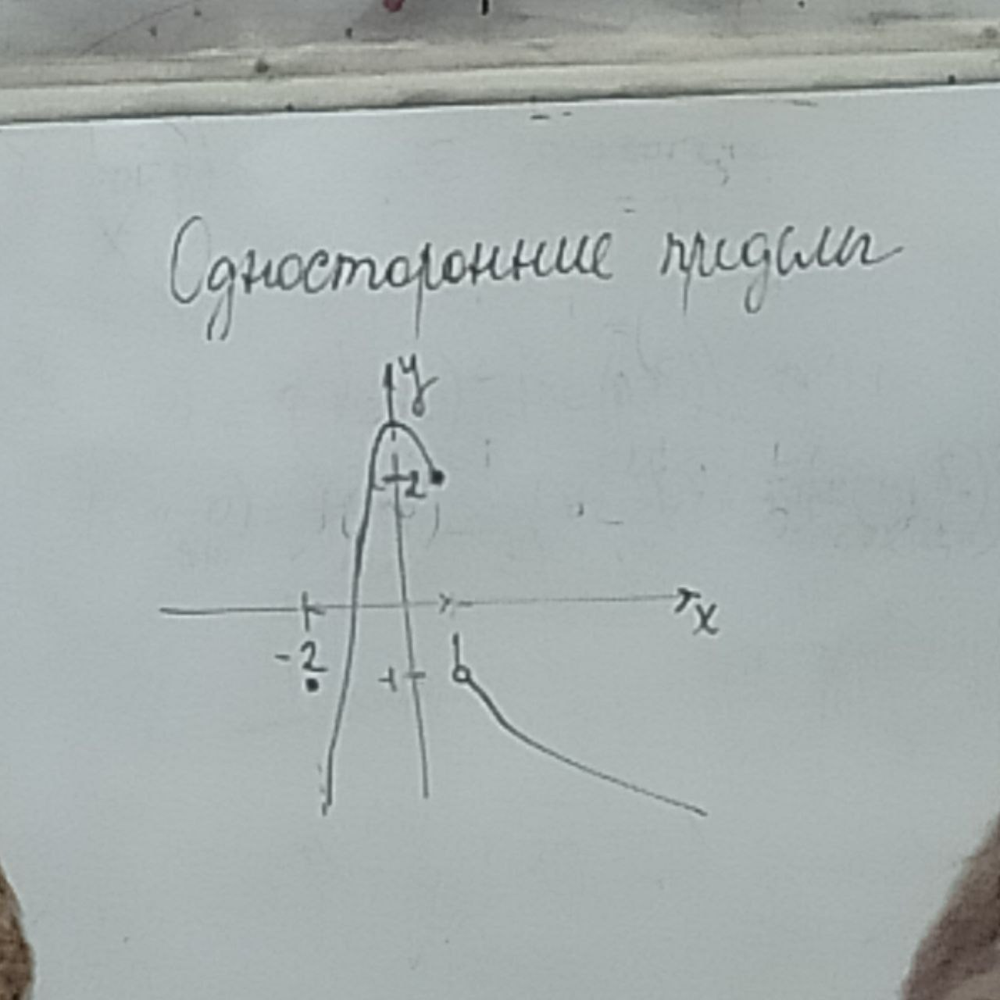
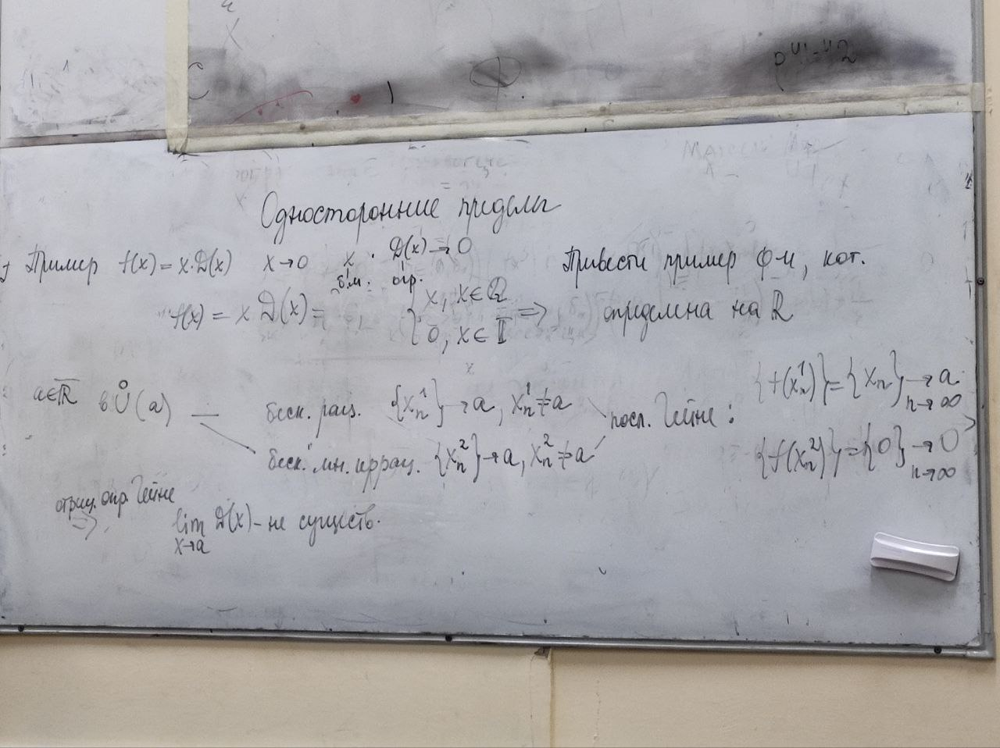

# Односторонний предел

$y=f(x)$ - определена в $\cup^\circ_{\delta_0}(a)$ $a\in\R\quad\cup^\circ_{\delta_0}(a)=(a-\delta_0;a)\cup(a;a+\delta_0)\\a=+\infty\quad\cup^\circ_{\delta_0}(+\infty)=\cup_{\delta_0}(+\infty)=(\frac{1}{\delta_0};+\infty)\\a=-\infty\quad\cup^\circ_{\delta_0}(-\infty)=\cup_{\delta_0}(-\infty)=(-\infty;-\frac{1}{\delta_0})$

$\widehat{\R} =\overline{\R}\cup\{\infty\}=\overline{\R} \cup \{+\infty,-\infty,\infty\}\quad \cup_{\delta_0}(\infty)=(-\infty;-\frac{1}{\delta_0})\cup(\frac{1}{\delta_0};+\infty)=\{x| |x| > \frac{1}{\delta_0}\}$

$\widehat{\R} \ni b=\displaystyle\lim_{x\to a-0}f(x)=f(a-0)$ - левое предельное значение функции $f$ в точке $a$ $\Leftrightarrow (\forall \epsilon > 0)(\exists \delta=\delta(\epsilon)\in(0;\delta_0))(\forall x \in \cup^{\circ+}_\delta(a)): f(x) \in \cup_\epsilon(a)$

$x\to a - 0$ - $x < a$

(по Коши) $\Leftrightarrow (\forall \epsilon > 0)(\exists \delta = \delta(\epsilon)\in (0;\delta_0))(\forall x \in \cup_\delta^-): f(x) \in \cup_\epsilon(b)$

$a \in \R, b\in\R : b = f(a-0) \Leftrightarrow (\forall \epsilon >0)(\exists \delta \in (0;\delta_0))(\forall x | x < a -x < \delta): |f(x) - b| < \epsilon$

$a = \infty, b = +\infty: b = f(\infty - 0) =f(-\infty)\Leftrightarrow (\forall \epsilon > 0)(\exists \delta \in (0;\delta_0))(\forall x | x < -\frac{1}{\delta}): f(x) > \frac{1}{\epsilon}$

Пример функции:
1. определена на $[-2;+\infty]$
2. $\displaystyle\lim_{x\to -2+0}f(x)=-\infty$
3. $\displaystyle\lim_{x\to 1-0}f(x)=2+0$
4. $\displaystyle\lim_{x\to 1+0}f(x)=-1-0$

$D(X)$ - определена на $\R$

Пусть $a \in \R\quad \forall \cup(a)$ - бесконечно много рациональных и иррациональных

$\{x_n^1\}\to a, x_n^1 \ne a$ - рациональные

$\{x_n^2\}\to a, x_n^2 \ne a$ - иррациональные

Последовательность гейне:

$D(x_n^1) = \{1\}\to_{n\to\infty}1$

$D(x_n^2) = \{0\}\to_{n\to\infty}0$

По определению Гейне: $\displaystyle\lim_{x\to a}D(x)$ - не существует

Пример $f(x) = xD(x)\quad x\to0$

## Монотонность функции

**Теорема о пределе монотонной функции**:

$y=f(x)$ - монотонна на $(a,b)$, $\forall x\in (a,b),\exists f(x\pm 0)$

1. $f$ возрастает на $(a,x_0) \Rightarrow \exists f(x_0-0)=\sup f(x)$
1. $f$ убывает на $(a,x_0) \Rightarrow \exists f(x_0-0)=\inf f(x)$
1. $f$ возрастает на $(x_0,b) \Rightarrow \exists f(x_0+0)=\inf f(x)$
1. $f$ возрастает на $(x_0,b) \Rightarrow \exists f(x_0+0)=\sup f(x)$

*Доказательство*:
1. $f$ возрастает нестрого $\Rightarrow (\forall x_1,x_2\in(a,x_1)|x_1<x_2):f(x_1)\le f(x_2)$

$\exists \sup f(x) = \beta \in \overline{\R} \Rightarrow$ $\forall x \in (a, x_2):f(x)\le\beta\\\forall \beta'\quad \exists x_\beta \in (a, x_0):f(x_\beta) \ge \beta$

Я вообще не понял, чё щас произошло

$\forall x > x_\beta: \beta < f(x_\beta) \le f(x) \le \beta$

$\forall \epsilon > 0 \quad \exists \delta \quad \forall x \in \cup^{\circ-}_\delta(x_0)\quad |f(x)-\beta| < \epsilon \Rightarrow \beta = \displaystyle\lim_{x\to x_0-0}f(x)=f(x_0-0)$

Если это кто-то читает и понял, чё произошло, то объясните мне пж

$\beta-\epsilon<f(x)<\beta+\epsilon$

$\delta=x_0-x_{\beta'}=x_0-x_{\beta-\epsilon}$

**Определение**:

$y=f(x)$ - возрастающая/убывающая на $(a,b) \Leftrightarrow (\forall x_1,x_2 \in (a,b) | x_1 < x_2): f(x_1)\le f(x_2)$ ($\ge$ для убыв.)

Если неравенства строгие тогда функция *строго монотонна*.

$y=f(x)$ - монотонна в точке $x_0$, если она монотонна в $\cup(x_0) = (a-\delta;a+\delta)$

**Определение**:

$\alpha = \inf f(x) \Leftrightarrow$
$1. \forall x \in X: f(x) \ge \alpha\\2.(\forall \alpha' > \alpha)(\exists \alpha' > \alpha)(\exists x' \in X): f(x') < \alpha'$

$\Leftrightarrow (\forall \epsilon > 0)(\exists x_\epsilon \in X): f(x_\epsilon) < \alpha + \epsilon\quad(\alpha \in \R)$