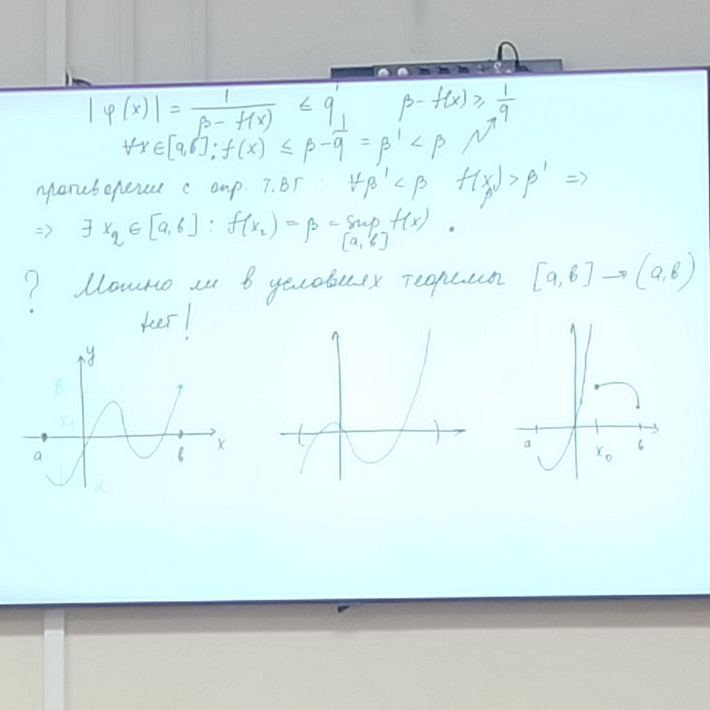

# Непрерывность
**Теореме о непрерывности сложной функции**: $y=f(x)$ - непрерывна в точке $x_0$, $x=\phi(t)$ - непрерывна в точке $t_0: \phi(t_0)=x_0 \Rightarrow$ сложная функция $y=f(\phi(t))$ - непрерывна в точке $t_0$
*Доказательство*: По определению через окрестности нужно доказать: $y=f(x)$ - непрерывна в точке $x_0 \Rightarrow$ $(\forall \cup(y_0)| y_0=f(x_0))(\exists \cup(x_0)): f(\cup(x_0)) \subset \cup(y_0)$

$x=\phi(t)$ - непрерывна в точке $t_0 \Rightarrow (\forall \cup(x_0)|x_0 = \phi(t_0))(\exists \cup(t_0)): \phi(\cup(t_0)) \in \cup(x_0)$

$(\forall \cup(y_0)|y_0=f(\phi(t_0)))(\exists \cup (t_0)): f(\phi(t_0)) \subset f(\cup(x_0)) \subset \cup(y_0)$

$\Rightarrow f \circ \phi (t)$ - непрерывна в $t_0$

Вопрос: $\displaystyle\lim_{x\to x_0}f(x) = A, \lim_{t\to t_0}\phi(t) = x_0 \Rightarrow ? \lim_{t\to t_0}f(\phi(t)) = A$ - нет!

Пример:
$$
\phi(t)=0, t \in \R\\
f(x) =
\begin{equation}
    \begin{cases}
      1, x = 0\\
      0, x \ne 0
    \end{cases}\,
\end{equation}
$$

$t_0=0, x_0=0$

$\displaystyle\lim_{x\to0}f(x)=0=A\quad\lim_{t\to0}f(\phi(t))=1\ne A$

**Теорема о пределе сложной функции**:

1. $y=f(x)$ - непрерывна в точке $x_0$, $x=\phi(t)$ определена в $\cup^\circ(t_0)$ $\exists\displaystyle\lim_{t\to t_0} \phi(t) = x_0 \Rightarrow \exists\lim_{t\to t_0}f(\phi(t)) = f(x_0)$
2. $\exists\displaystyle\lim_{x\to x_0}f(x)=A, \exists\displaystyle\lim_{t\to t_0}\phi(t)=x_0:\phi(t)\in \cup^\circ(x_0)\Rightarrow \exists\displaystyle\lim_{t\to t_0}f(\phi(t))=A$

*Доказательство*: по теореме о непрерывности сложной функции при доопределении или переопределении функций $\phi,f$

## Глобальные свойства
Свойства непрерывных функций на *отрезке*

Определение: $y=f(x) - \textrm{непрерывна на } [a,b] \Rightarrow \forall x_0 (a,b): f - \textrm{непрерывна в } x_0\\f - \textrm{непрерывна слева в теореме Вейерштрасса (об ограниченности и достижениий точных граней)}$

$y=f(x)$ - непрерывна на $[a,b] \Rightarrow$

$1) y = f(x) - \textrm{ограничена на } [a,b]\\2)\exists x_1,x_2 \in [a,b]: f(x_1) = \inf f(x)\ [a,b], \quad f(x_2)=\sup f(x)\ [a,b]$

*Доказательство (от противного)*: $f$ - неограничена на $[a,b] \Rightarrow$

1. $(\forall q \in \R)(\exists x_q \in [a,b]): |x_q| > q$

$q = n \in \N\quad$ $n=1\ \exists x_1 \in [a,b]: |f(x_1)| > 1\\n=2\ \exists x_2 \in [a,b]: |f(x_2)| > 2\\\dots\\n\ \exists x_n \in [a,b]: |f(x_n)| > n\\\{x_n\}\quad \quad \quad \quad\ \{f(x_n)\}$

$\forall n \in \N: a \le x_n \le b \Rightarrow$ ограничена $(\forall \epsilon > 0)(\exists n \in \N)(\forall n \ge \N): |f(x_n)| > N = [\frac{1}{\epsilon}]+1 > \frac{1}{\epsilon} \Rightarrow$

$\{f(x_n)\}$ - б.б.п, $\displaystyle\lim_{n\to\infty}f(x_n)=\infty$

так как $x_n$ ограничена по т. Б-В $\Rightarrow$

$\exists \{x_{n_k}\}$ - сходящаяся $\Rightarrow$

$\exists \displaystyle\lim_{k\to\infty}x_{n_k}=c\in[a,b]$ (предельные переход в неравенстве)

т.к. $f$ - непрерывна на $[a,b] \Rightarrow$
$f$ - непрерывна в точке $c \Rightarrow \exists \displaystyle\lim_{k\to\infty}f(x_{n_k})=f(c)$ - противоречие

$\{f(x_{n_k})\} \subset \{f(x_n)\} \subset \cup(\infty) \Rightarrow f$ - ограничена на $[a,b]$

2. Пусть $\beta = \sup_{[a,b]} f(x)\Rightarrow$ $1)\forall x \in [a,b]: f(x) \le \beta\\2)\forall \beta' < \beta\ \exists x_{\beta'} \in [a,b]: f(x_{\beta'}) > \beta' - \epsilon$

Противоречие: $f$ - не достигает своей точной грани

из 1. $f$ - ограничена $\Rightarrow \beta \in \R, \forall x \in [a,b]: f(x) < \beta$

Вспомогательная функция $\phi(x)=\frac{1}{\beta - f(x)}$ - непрерывн, т.к. знак $\ne 0, f$ - непрерывна $\Rightarrow$

$\phi$ - ограничена, т.к. $(\exists q \in \R)(\forall x \in [a,b]): |\phi(x)|\le q$

$|\phi(x)=\frac{1}{\beta - f(x)} \le q, f(x) \le \beta - q = \beta' <\beta$ - противоречие с определением т.в.г.: $\forall \beta' < \beta\quad f(x_{\beta'})>\beta'$

$\Rightarrow \exists x_2 \in [a,b]: f(x_2) = \beta = \sup_{[a,b]}f(x)$

? Можно ли в условиях теоремы $[a,b] \to (a,b)$ - нет!

