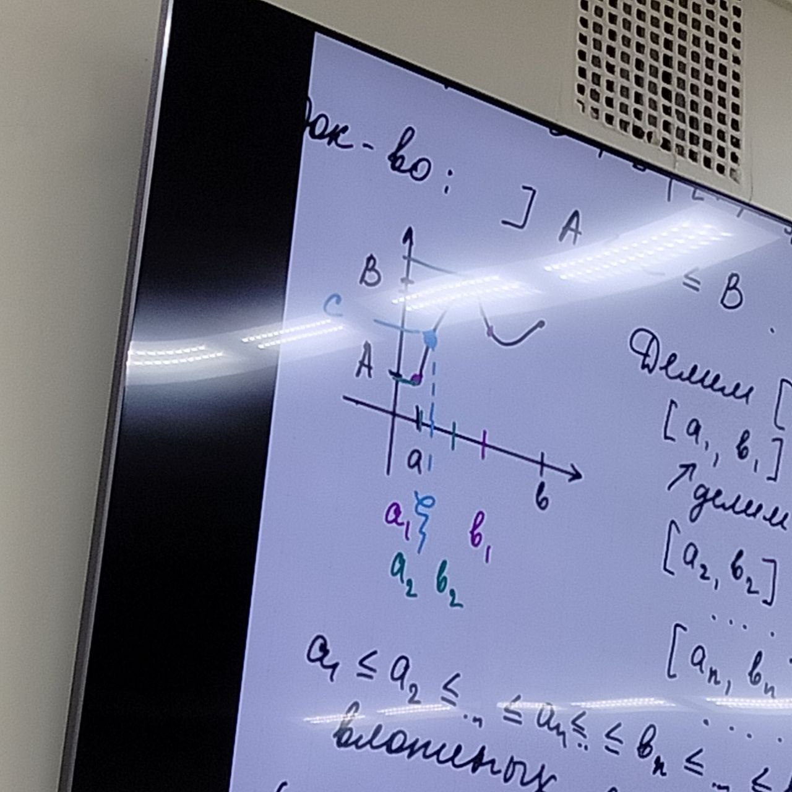
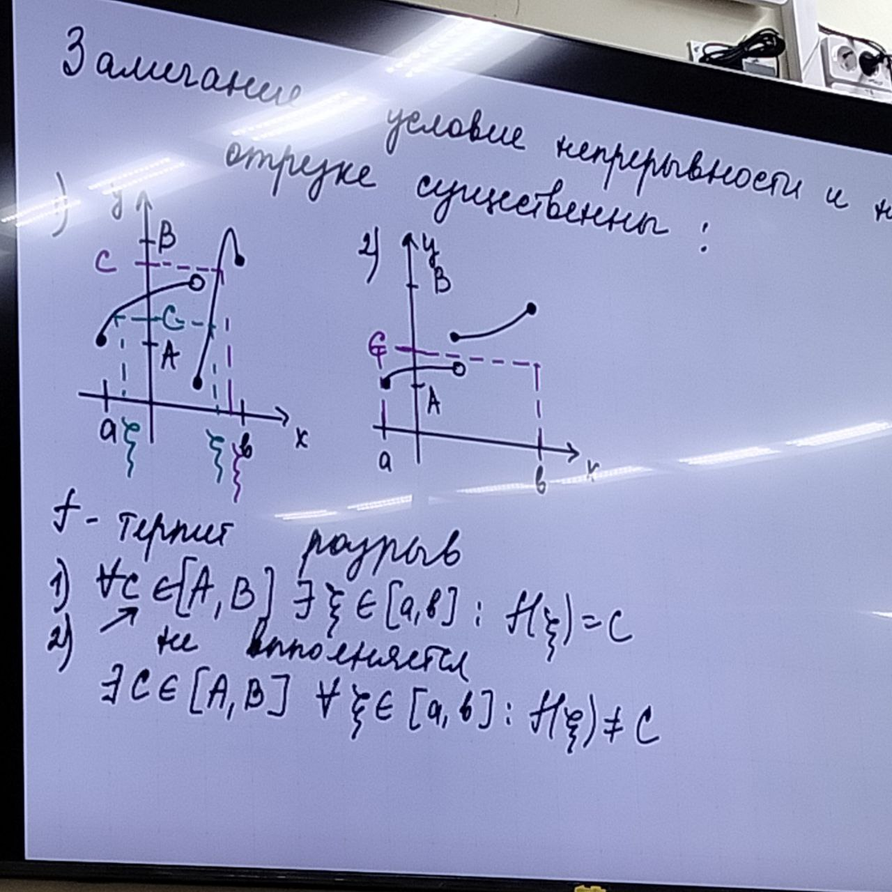

**Определение**:
...

**Теорема о промежуточных значениях (теорема Больцано-Коши)**:

$f$ - непрерывна на отрезке $[a,b]$, $\Rightarrow$ она принимает все значения из промежутка с концами $f(a), f(b)$

$A=f(a), B=f(b), f - \textrm{непр. на } [a,b] \Rightarrow \forall C \in [A,B]\ ([B,A]) \exists \xi \in [a,b]: f(\xi) = C$

*Доказательство*: Пусть $A \le C \le B$

Делим $[a,b]$ пополам $\to [a_1,b_1]: f(a_1) \le C \le f(b_1)$, $[a_1,b_1]$ делим пополам $\to [a_2,b_2]: f(a_2) \le C \le f(b_2) \dots$ $[a_n,b_n]: f(a_n) \le c \le f(b_n)\ \dots$ (1)

$a_1 \le a_2 \le \dots \le a_n \le b_n\le \dots \le b_1 \Rightarrow \{[a_n,b_n]\}$ - система вложенных отрезков

$(\forall \epsilon > 0)(\exists n_\epsilon = [\log_\frac{1}{2}\epsilon]+1)(\forall n \ge n_\epsilon) : 0 \le b_n a_n=\frac{1}{2^n} < \epsilon,\ n > \log_\frac{1}{2}\epsilon\Rightarrow$

$\{[a_n,b_n]\}$ - стягивающаяся система вложенных отрезков

по принципу Кантора $\Rightarrow \exists \xi\in [a_n,b_n]\ \forall n \in \N \Leftrightarrow a_n \le \xi \le b_n$ (2)

Переходя к пределу в (1), (2) $\{a_n\} \to \xi, \{b_n\} \to \xi$, в систему непрерывности функции $f$: $f(a_n) \le C \le f(b_n) \Rightarrow \textrm{ предельный переход } f(\xi) \le C \le f(\xi) \Rightarrow C = f(\xi)$

Замечаем: условие непрерывности и на отрезке существенны

**Теорема (критерий непрерывности монотонной функции)**:

$f$ - монотонна и непрерывна на $[a,b] \Leftrightarrow f - \textrm{монотонная на } [a,b] \textrm{ и её значения сплошь заполняют отрезок } [f(a),f(b)](\uparrow)\ или\ [f(b), f(a)](\downarrow)$

*Доказательство (самостоятельно)*:

Небходимость $\Rightarrow$ теорема Б-К

Достаточность $\Leftarrow$ от противного

Следствие из теоремы Б-К
1. $f - \textrm{непрерывна на } [a,b], f(a)\cdot f(b) < 0 \Rightarrow \exists \xi \in [a,b] : f(\xi)=0$
2. $f - \textrm{непрерывна на } [a,b], m = \displaystyle\min_{[a,b]}f, M = \displaystyle\max_{[a,b]}f(т. В) \Rightarrow f$ принимает все значения $[m, M]$ и только эти значения

# Обратные функции

$f: X \to Y_f\quad$ $X -\textrm{область определения}\\Y_f - \textrm{область значений функции}$

$\forall x_1, x_2 \in X | x_1 \ne x_2 \Rightarrow f(x_1) \ne f(x_2) \Rightarrow X \leftrightarrow Y_f$

$\exists f^{-1}: Y_f \to X$ - обратная функция

1. $y=f(x) \Leftrightarrow x = f^{-1}(y)$
2. $f^{-1}(f(x))=x\quad \forall x \in X$
3. $f(f^{-1}(y)) = y\quad \forall y \in Y_f$
4. Графики функции $f\ и\ f^{-1}$ симметричны относительно $y=x$
5. $f$ - строго монотонна на $X \Rightarrow \exists f^{-1}$ - строго монотонна (той же монотонности) на $Y_f$

*Доказательство*: $f$ - строго возрастающая $\Rightarrow \forall x_1, x_2 \in X | x_1 < x_2 \to f(x_1) < f(x_2)$

Обозначим $y_1=f(x_1), y_2=f(x_2)$

От противного, пусть $f^{-1}$ не строго возрастающая (убывающая), $y_1 < y_2 \Rightarrow x_1 = f^{-1}(y_1) \ge f^{-1}(y_2)=x_2$ противоречит тому, что $x_1 < x_2$

**Теорем о непрерывности обратной функции**:
$f$ - непрерывна на $[a,b]$, строго возрастающая (строго убывающая) $\Rightarrow \exists f^{-1}$ - строго возрастающая (строго убывающая) на $[f(a), f(b)]$ ($[f(b), f(a)]$)

*Доказательство*: $\exists f^{-1}$ следует из определения и строгой монотонности функции $f$

Докажем непрерывность функции $f$ на $[a,b]$ по определению

$\forall x_0 \in (a,b): f - \textrm{непрерывна в точке } x_0, \textrm{ в точке a} - f - \textrm{непрерывна справа}, \textrm{ в точке } b - f - \textrm{непрерывна слева}$

