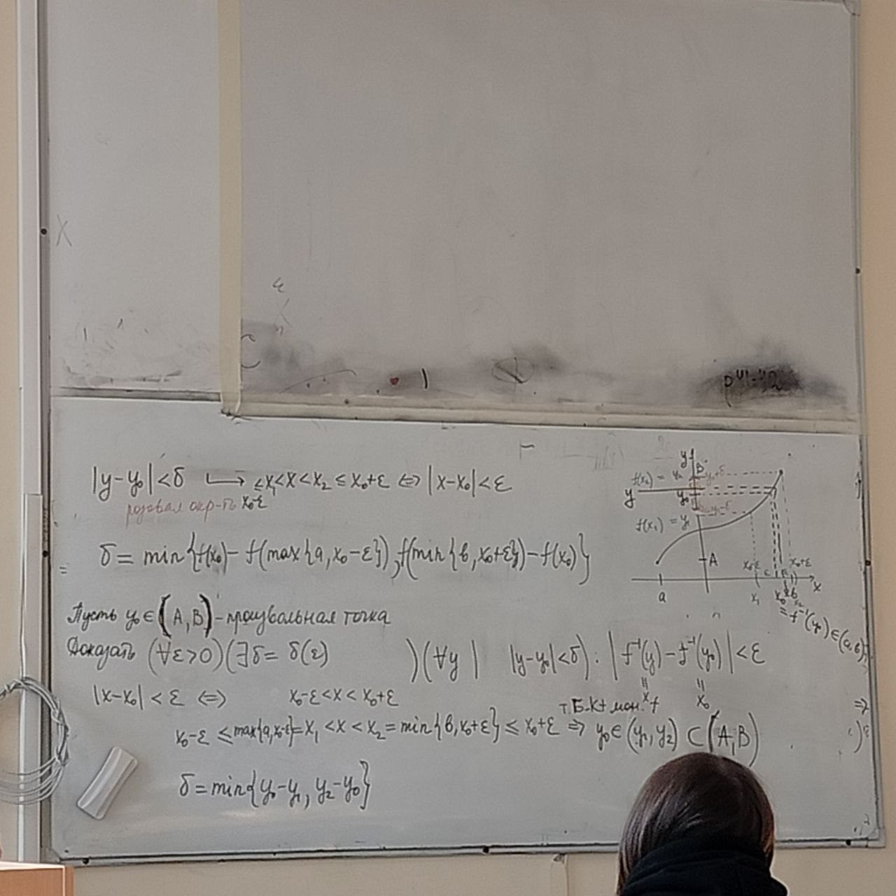
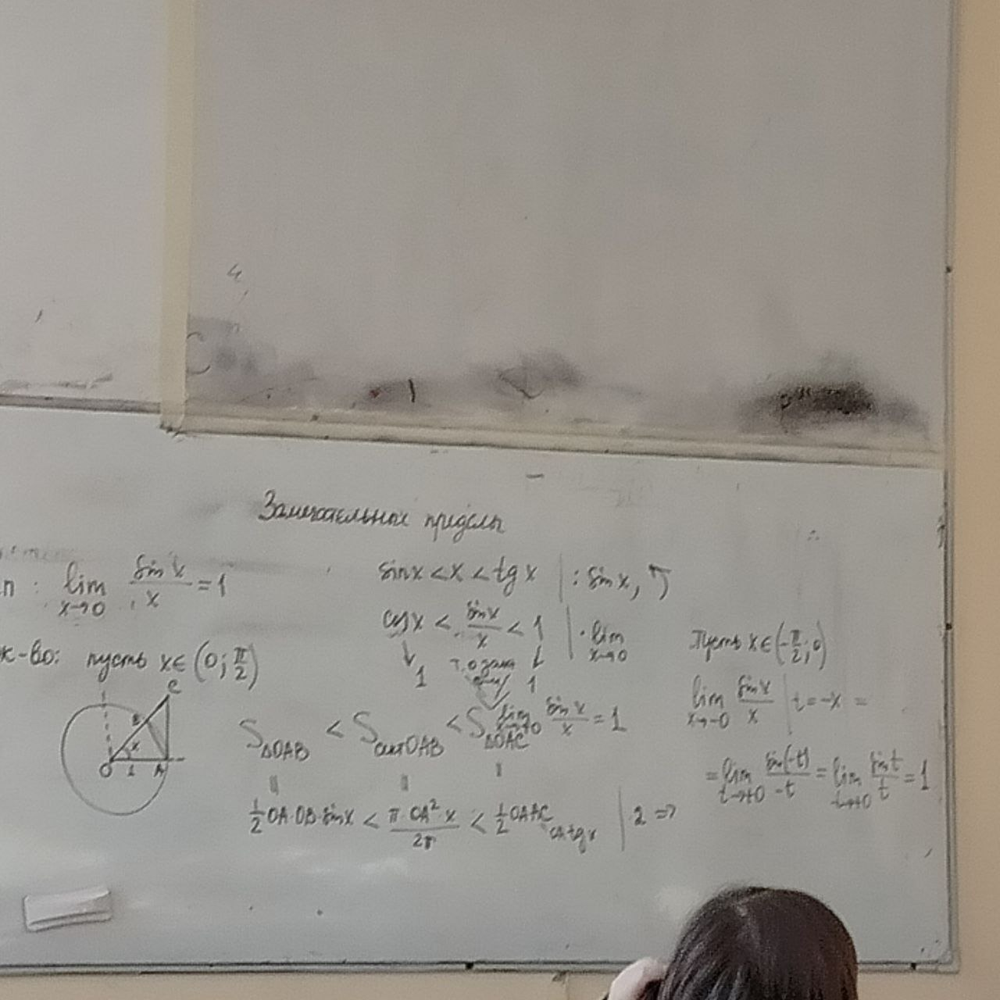

# Обратные функции

*Доказательство*:
$y=f(x)$ - строго монотонно (строго возрастает-строго убывает)

От противного: $\forall x_1 \ne x_2\quad f(x_1)=f(x_2)$

Противоречие: $\forall x_1 < x_2\ (x_1 > x_2) \Rightarrow f(x_1) < f(x_2)$ (либо меньше, если убывает)

$\forall x_1 \ne x_2: f(x_1) \ne f(x_2) \Rightarrow \exists f^{-1}$

*Доказательство*: $f$ - строго возрастает, то и $f^{-1}$ строго возрастает

От противного $f^{-1}$ - не строго возрастает $\Rightarrow \exists y_1 < y_2 : x_1 = f^{-1}(y_1) \ge f^{-1}(y_2)=x_2$

$\Rightarrow x_1 \ge x_2$ - противоречие строгому возрастанию функции

$x_1=x_2 \Rightarrow f(x_1) = f(x_2) \Rightarrow y_1=y_2$
$x_1 > x_2 \Rightarrow f(x_1) > f(x_) \Rightarrow y_1 \ge y_2$

$\Rightarrow$ Предположение верно, $f^{-1}$ - строго возрастающая

**Теорема о непрерывности обратной функции**:

$y=f(x)$ - строго монотонная и непрерывная на $[a,b] \Rightarrow$

$\Rightarrow \exists x = f^{-1}(y)$ - строго монотонная (той же монотонности) и непрерывная на $[A,B]$

$f\uparrow\quad A=\displaystyle\min_{[a,b]}f(x)=f(a) | f(b)$

$f\downarrow\quad B=\displaystyle\max_{[a,b]}f(x)=f(b) | f(a)$

$f: [a,b] \to Y_f$

$[A,B]=[f(a),f(b)]$

$\forall x \in [a,b]\ \exists f(x) \in [f(a),f(b)]\Rightarrow Y_f \subseteq [A,B]$

$\forall C \in [A,B]\ \exists \xi \in [a,b]: f(\xi)=C$- по т. Больцано-Коши (о промежуточном значении)

Пусть $y_0\in[A,B]$ - произвольная точка

*Доказать*: $(\forall \epsilon > 0)(\exists \delta = )(\forall y |\ |y-y_0| < \delta): |f^{-1}(y) - f^{-1}(y_0)| < \epsilon$

$|x-x_0| < \epsilon \Leftrightarrow x_0 - \epsilon < x < x_0 + \epsilon$

$x_0 - \epsilon \le \max\{a,x_0-\epsilon\}=x_1 \le x \le x_2 = \min \{b,x_0+\epsilon\}$

Следствие: $y=f(x)$ - строго монотонно и непрерывна на (a,b) $\Rightarrow \existx = f^{-1}(y)$ - той же сторогой монотонной и непрерывна на $[A,B]$

$A=\displaystyle\inf_{(a,b)}f(x)=f(a+0)$

$B=\displaystyle\sup_{(a,b)}f(x)=f(b+0)$

# Доказательство замечательных пределов

## 1 замечательный предел

$\displaystyle\lim_{x\to0}\frac{\sin x}{x}=1$

*Доказательство:* $x\in(0;\frac{\pi}{2})$

## 2 замечательный предел

