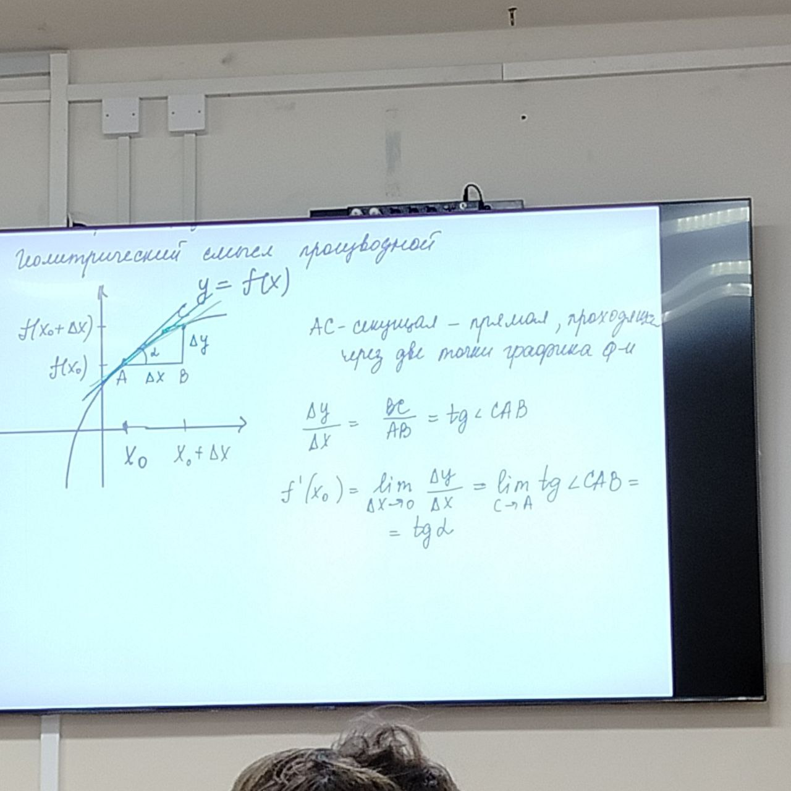
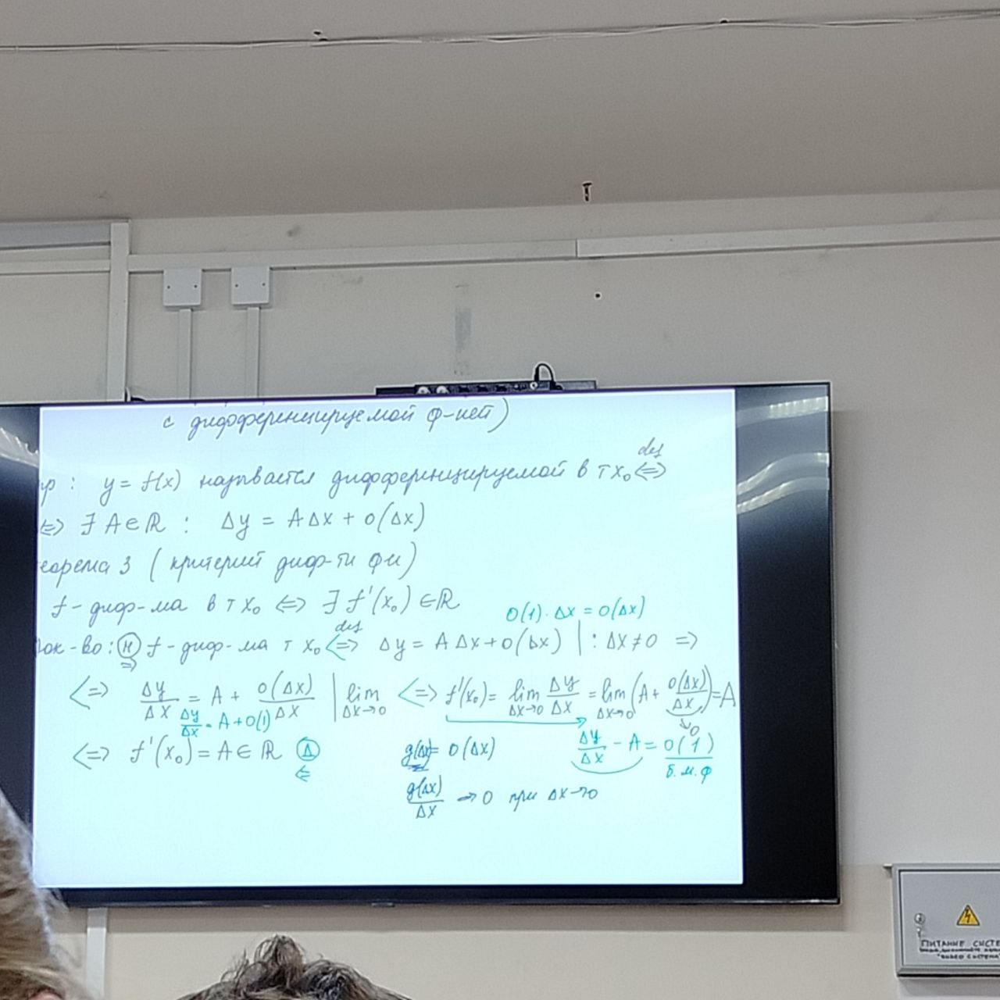
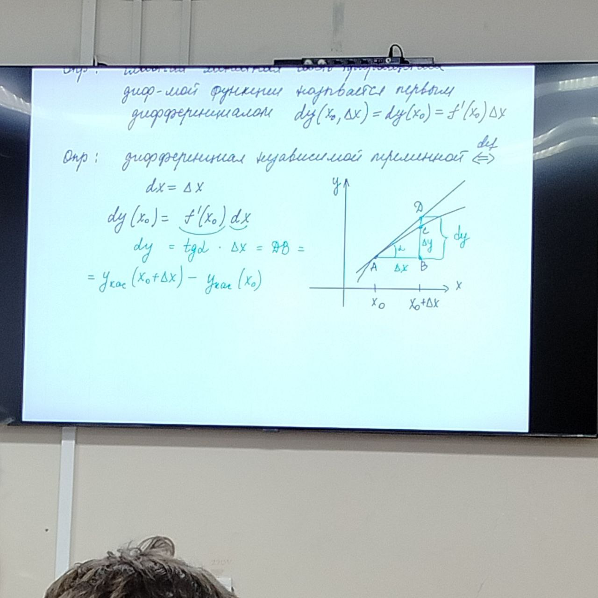

# Дифференцирование функций

Учебник - Иванов Г. Е.

Рассмотрим функцию $y=f(x)$ определённой в $\cup_{\delta_0}(x_0)$

$\Delta x = x - x_0\quad x = x_0 + \Delta x \in \cup_{\delta_0}(x_0)$

$\Delta y (x_0, \Delta x) = f(x_0 + \Delta x) - f(x_0)$

Определена: $f'(x_0) = \displaystyle\lim_{\Delta x \to 0} \frac{\Delta y(x_0, \Delta x)}{\Delta x}$, если он существует

$\forall x_0 \in D \subseteq \R\quad\exists\displaystyle\lim_{\Delta x \to 0} \frac{\Delta y(x_0, \Delta x)}{\Delta x}: y = f'(x)$ - функция, которая будет определена на $D \subseteq \R$

## Геометрический смысл

**Определение**: Прямая $AD$ называется касательной к графику функции $y=f(x)$ в точке $x_0$, если она является предельным положением секущей $AC$ при $C \to A$ по кривой

Прямая проходящая через точку $(x_0, f(x_0)): y - f(x_0) =k(x-x_0)$

Для касательной: $k=\tg\alpha=f'(x_0)$

**Уравнение касательной (не вертикальной)**:
$y - f(x_0)=f'(x_0)(x - x_0)$

**Вертикальной**:

$f'(x_0) = \pm\infty$

$f'(x_0)=\tg \alpha=+\infty\Rightarrow\alpha=\frac{\pi}{2}$

Уравнение касательной: $x=x_0$

**Теорема (о геометрическом смысле производной)**:

$\exists f'(x_0)\Leftrightarrow\exists AD - \textrm{касательная к графику функции в точке } x_0$

**Определение**:

$f_{-}'(x_0) = \displaystyle\lim_{\Delta x \to -0} \frac{\Delta y(x_0, \Delta x)}{\Delta x}$ - левая односторонняя производная

$f_{+}'(x_0) = \displaystyle\lim_{\Delta x \to +0} \frac{\Delta y(x_0, \Delta x)}{\Delta x}$ - правая односторонняя производная

**Теорема (критерий существования производной)**:

$\exists f'(x_0) \Leftrightarrow \exists f_{-}'(x_0)=f_{+}'(x_0)$ (Доказательство из пределов: предел существует только тогда, когда равны его левые и правые пределы)

**Замечание**: операция нахождения производной называет дифференцированием (!не путать с дифференцируемой функцией)

**Определение**: $y=f(x)$ называется *дифференцируемой* в точке $x_0 \Leftrightarrow \exists A \in \R: \Delta y = A \Delta x + o(\Delta x)$

**Теорема (критерий дифференцируемости функции)**:

$f$ - дифференцируема в точкек $x_0 \Leftrightarrow \exists f'(x_0) \in \R$

*Доказательство*: $f$ - дифференцируема в точке $x_0 \Rightarrow \Delta y = A \Delta x + o(\Delta x) | : \Delta x \ne 0$

$\Rightarrow \frac{\Delta y}{\Delta x}= A + \frac{o(\Delta x)}{\Delta x} | \displaystyle\lim_{\Delta x \to 0} \Rightarrow f'(x_0)=\displaystyle\lim_{\Delta x \to 0}(A+\frac{o(\Delta x)}{\Delta x}) = A$

$\Rightarrow f'(x_0)=A \in \R$

*Достаточность (голубым)*:

**Следствие**: $y=f(x)$ - дифференцируема в точке $x_0 \Rightarrow$

$\Delta y = f'(x_0)\Delta x + o(\Delta x)$

**Определение**: Главная линейная часть приращения дифференцируемой функции называется первым дифференциалом $dy(x_0, \Delta x)=dy(x_0)=f'(x_0)\Delta x$

**Определение**: Дифференциал независимой переменной $\Leftrightarrow dx=\Delta x\quad dy(x_0)=f'(x_0)dx$

$dy=\tg \alpha \cdot \Delta x = DB = y_{кас}(x_0+\Delta x)-y_{кас}(x_0)$

**Теорема (критерий дифференцируемости)**:

$f$ - дифференцируема в точке $x_0 \Leftrightarrow \exists$ не вертикальная касательная в точке $x_0$

**Теорема (необходимое условие дифференцируемости функции)**:

$f$ - дифференцируема в точке $x_0 \Rightarrow f$ - непрерывна в точке $x_0$

*Доказательство*: $f$ - дифференцируема в точке $x_0 \Rightarrow \Delta y = A \Delta x + o(\Delta x) = \Delta x(A + \frac{o(\Delta x)}{\Delta x}) \to 0\quadпри\ \Delta x \to 0\Rightarrow f$ - непрерывна в точке $x_0$

**Замечание**: непрерывность не является *достаточным условием* дифференцируемости: $y=|x|\quad y'_{-}(0)=-1, y'_{+}(0)=1\Rightarrow(кр)\ \not\exists y'(0)\Rightarrow y - \textrm{не дифференцируема в } x = 0, y=|x| -\ непрерывна\ на\ \R\Rightarrow y -\ непрерывна\ в\ x=0$

## Правила дифференцирования

$y=f(x), y=g(x)$ - дифференцируемые в точке $x_0$ (в $\cup(x_0)$)
$\Rightarrow$

1. $(C)'=0, c \in \R$
2. $(af(x)+bg(x))'=af'(x)+bg'(x)$, $a,b \in \R$
3. $(f(x)\cdot g(x))'=f'(x)\cdot g(x) + f(x)\cdot g'(x)$
4. $\forall x \in \cup(x_0)\to g(x)\ne0: (\frac{f(x)}{g(x)})' = \frac{f'(x)g(x)-f(x)g'(x)}{g^2(x)}$

*Доказательство*: по определению производных
1. $(C)'=\displaystyle\lim_{\Delta x \to 0} \frac{y(x_0 + \Delta x) - y(x_0)}{\Delta x}=\lim_{\Delta x \to 0}\frac{C - C}{\Delta x}=\lim_{\Delta x \to 0}0=0$
4. $\Delta f = f(x_0+\Delta x)-f(x_0) \Rightarrow f(x_0 + \Delta x)=f(x_0)+\Delta f$

$g(x_0 + \Delta x) = g(x_0) + \Delta g$

$(\frac{f(x)}{g(x)})' = \displaystyle\lim_{\Delta x \to 0} \frac{\Delta (\frac{f}{g})}{\Delta x} = \lim_{\Delta x \to 0} \frac{1}{x}(\frac{f(x_0+\Delta x)}{g(x_0+\Delta x)} - \frac{f(x_0)}{g(x_0)}) = \lim_{\Delta x \to 0} \frac{(f(x_0)+\Delta f)g(x_0) - f(x_0)(g(x_0) + \Delta g)}{\Delta x g(x_0 + \Delta x)g(x_0)} = \lim_{\Delta x \to 0} (\frac{\Delta f}{\Delta g}g(x_0) - f(x_0)\frac{\Delta g}{\Delta f}) \cdot \frac{1}{g(x_0 + \Delta x)g(x_0)}=  \frac{f'(x)g(x)-f(x)g'(x)}{g^2(x)}$