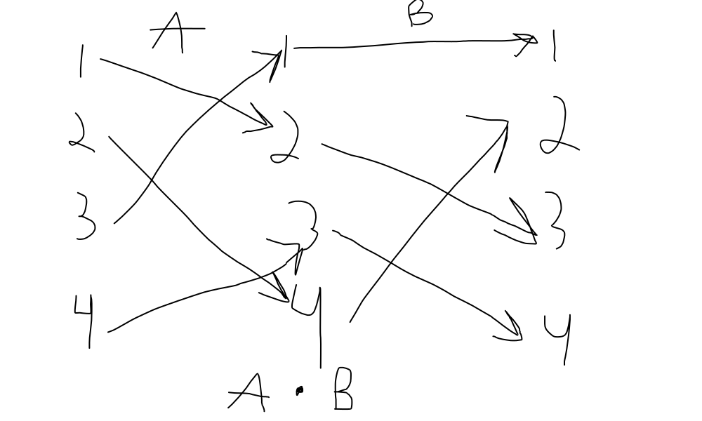

# Подстановки

**Подстановка n-ой степени или подстановка из n символов** называется любое взаимнооднозначное отображение множества этих символов на себя

Пример задания перестановки:

$$
\left( {\begin{array}{cc}
    1 & 2 & 3 \\
    3 & 1 & 2\\
  \end{array} } \right)

\\
\left( {\begin{array}{cc}
    2 & 1 & 3 \\
    1 & 3 & 2\\
  \end{array} } \right)
$$

Стандартная запись подстановки:

$$
\left( {\begin{array}{cc}
    1 & 2 & \dots & n \\
    \alpha_1 & \alpha_2 & \dots &\alpha_n\\
  \end{array} } \right)
$$

Подстановка называется *чётной*, если верхие и нижние строки перестановки одинаковой чётности, иначе подстановка называется *нечётной*. В стандартной форме чётность подстановки совпадает с чётностью перестановки 2 строки.

$$
E =
\left( {\begin{array}{cc}
    1 & 2 & \dots & n \\
    1 & 2 & \dots & n\\
  \end{array} } \right)
- \textrm{тождественная подстановка}
$$

## Произведение подстановок

Если степень подстановки одинаковой степени, то можно ввести произведение подстановок

*Произведение двух подстановок* одного и того же порядка называется результат последовательного выполнения тех отображений, которые задают эти подстановки

$$
A=
\left( {\begin{array}{cc}
    1 & 2 & 3 & 4 \\
    2 & 4 & 1 & 3\\
  \end{array} } \right)\\

B=
\left( {\begin{array}{cc}
    1 & 2 & 3 & 4 \\
    1 & 3 & 4 & 2\\
  \end{array} } \right)\\

B\cdot A = 
\left( {\begin{array}{cc}
    1 & 2 & 3 & 4 \\
    3 & 2 & 1 & 4\\
  \end{array} } \right)\\
$$

- Коммутативность не выполняется
- Тождественная подстановка играет роль единицы
- Обратная подстановка

$$
A^{-1} =
\left( {\begin{array}{cc}
    2 & 4 & 1 & 3 \\
    1 & 2 & 3 & 4\\
  \end{array} } \right) =
\left( {\begin{array}{cc}
    1 & 2 & 3 & 4 \\
    3 & 1 & 4 & 2\\
  \end{array} } \right)
- \textrm{после упорядочивания}
$$

$$
A^{-1}=
\left( {\begin{array}{cc}
    \alpha_1 & \alpha_2 & \dots &\alpha_n\\
    1 & 2 & \dots & n \\
  \end{array} } \right)\\
A \cdot A^{-1} = E\\
A ^ {-1} \cdot A = E
$$
- Ассоциативно

# Определители n-ого порядка

$$
A =
\left( {\begin{array}{cc}
    a_{11} & a_{12} & \dots & a_{1n} \\
    a_{21} & a_{22} & \dots & a_{2n} \\
    \dots & \dots & \dots & \dots \\
    a_{n1} & a_{n2} & \dots & a_{nn} \\
  \end{array} } \right)
$$

Определителем n-ого порядка называется алгебраическая сумма $n!$ слагаемых, каждое из которых является произведением $n$ элементов матрицы, взятых по одному из каждой строки и каждого столбца, при этом произведением берётся со знаком $+$, если подстановка из индексов входящих в него элементов чётная, и со знаком $-$ в противном случае.

$$
|A| =
\left| {\begin{array}{cc}
    a_{11} & a_{12} & \dots & a_{1n} \\
    a_{21} & a_{22} & \dots & a_{2n} \\
    \dots & \dots & \dots & \dots \\
    a_{n1} & a_{n2} & \dots & a_{nn} \\
  \end{array} } \right|
$$

$$
n = 6 \\
a_{12}a_{23}a_{31}a_{45}a_{54}a_{66} - \textrm{элемент определителя}\\
\left( {\begin{array}{cc}
    1 & 2 & 3 & 4 & 5 & 6 \\
    2 & 3 & 1 & 5 & 4 & 6\\
  \end{array} } \right) - \textrm{нечётная перестановка, поэтому знак } - \\
$$

Всего в $|A|$ кол-во слагаемых $ = 6! = 720$

## Свойства определителя n-ого порядка

...Свойства из практики...

8. Дополнительный минор и алгебраическое дополнение не зависят от того, какой элемент стоит в i-ой строке и k-ом столбце определителя

$$
|A| =
\left| {\begin{array}{cc}
    a_{11} & a_{12} & \dots & a_{1k} & \dots & a_{1n} \\
    a_{21} & a_{22} & \dots & a_{2k} & \dots & a_{2n} \\
    \dots & \dots & \dots & \dots & \dots & \dots \\
    a_{i1} & a_{i2} & \dots & a_{ik} & \dots & a_{in} \\
    \dots & \dots & \dots & \dots & \dots & \dots\\
    a_{n1} & a_{n2} & \dots & a_{nk} & \dots & a_{nn} \\
  \end{array} } \right|
$$

*Дополнительными минором для элемента* $a_{ik}$ ($M_{ik}$) называется определитель n-1 порядка, который получается из исходного вычёркиванием i-ой строки и k-ого столбца

Пример:

$$
\left| {\begin{array}{cc}
    1 & 2 & 0 & 3 \\
    1 & 1 & 3 & 4 \\
    0 & 2 & -1 & 3 \\
    1 & 0 & 0 & 2
  \end{array} } \right|
\quad
  М_{23} = \left| {\begin{array}{cc}
    1 & 2 & 3 \\
    0 & 2 & 3 \\
    1 & 0 & 2
  \end{array} } \right|
=  (4+6)-6 =4
$$

Алгебраическим дополнением для элемента $a_{ik}$ называется число $A_{ik}$, которое равно дополнительному минору для этого элемента, умноженному на -1 в степени $i + k$: $A_{ik} = (-1)^{i+k}\cdot M_{ik}$

**Лемма 1**:

$$
\left| {\begin{array}{cc}
    a_{11} & 0 & \dots & 0 \\
    a_{21} & a_{22} & \dots & a_{2n} \\
    \dots & \dots & \dots & \dots \\
    a_{n1} & a_{n2} & \dots & a_{nn} \\
  \end{array} } \right|
= a_{11} \cdot A_{11}
$$

*Доказательство*:
1. $a_{11} = 0 \quad |A| = 0 \quad 0 \cdot A_{11} = 0$
2. $a_{11} \ne 0$

Ненулевые слагаемые:

$a_{11}, a_{2\alpha_2},\dots,a_{n\alpha_{n}}\\{\alpha}_i \in \{2, \dots, n\}$

$$
\left( {\begin{array}{cc}
    1 & 2 & \dots & n \\
    1 & \alpha_2 & \dots & \alpha_n\\
  \end{array} } \right)
\left( {\begin{array}{cc}
    2 & \dots & n \\
    \alpha_2 & \dots & \alpha_n\\
  \end{array} } \right)
- \textrm{совпадает чётность}
$$

**Лемма 2**:

$$
|A| =
\left| {\begin{array}{cc}
    a_{11} & a_{12} & \dots & a_{1k} & \dots & a_{1n} \\
    a_{21} & a_{22} & \dots & a_{2k} & \dots & a_{2n} \\
    \dots & \dots & \dots & \dots & \dots & \dots \\
    0 & 0 & \dots & a_{ik} & \dots & 0 \\
    \dots & \dots & \dots & \dots & \dots & \dots\\
    a_{n1} & a_{n2} & \dots & a_{nk} & \dots & a_{nn} \\
  \end{array} } \right|
=a_{ik} \cdot A_{ik}
$$

$$
|A| =
\left| {\begin{array}{cc}
    a_{11} & a_{12} & \dots & a_{1k} & \dots & a_{1n} \\
    a_{21} & a_{22} & \dots & a_{2k} & \dots & a_{2n} \\
    \dots & \dots & \dots & \dots & \dots & \dots \\
    0 & 0 & \dots & a_{ik} & \dots & 0 \\
    \dots & \dots & \dots & \dots & \dots & \dots\\
    a_{n1} & a_{n2} & \dots & a_{nk} & \dots & a_{nn} \\
  \end{array} } \right|
=(-1)^{i+k-2} \cdot \left| {\begin{array}{cc}
    a_{11} & 0 & \dots & 0 \\
    \vdots & M_{ik} & - & - \\
    \vdots & | \\
    \vdots & | \\
    \vdots & | \\
  \end{array} } \right|
=  \\
= a_{ik} \cdot (-1)^{i+k-2}\cdot M_{ik} = a_{ik}\cdot (-1) ^{i+k} \cdot M_{ik} = a_{ik} \cdot A_{ik}
$$

Пример:

$$
\left| {\begin{array}{cc}
    1 & 2 & 3 \\
    1 & 1 & 1 \\
    0+2 & 0+3 & 1+0
  \end{array} } \right|
-
\left| {\begin{array}{cc}
    1 & 2 & 3 \\
    1 & 1 & 1 \\
    0 & 0 & 1
  \end{array} } \right|
+
\left| {\begin{array}{cc}
    1 & 2 & 3 \\
    1 & 1 & 1 \\
    0+2 & 0+3 & 0+0
  \end{array} } \right|
=\\= \left| {\begin{array}{cc}
    1 & 2 & 3 \\
    1 & 1 & 1 \\
    0 & 0 & 1
  \end{array} } \right|
+
\left| {\begin{array}{cc}
    1 & 2 & 3 \\
    1 & 1 & 1 \\
    0 & 3 & 0
  \end{array} } \right|
+
\left| {\begin{array}{cc}
    1 & 2 & 3 \\
    1 & 1 & 1 \\
    2 & 0 & 0
  \end{array} } \right|
=\\=
1\cdot(-1)^{3+3} \cdot
\left| {\begin{array}{cc}
    1 & 2 \\
    1 & 1 \\
  \end{array} } \right|
+ 3 \cdot (-1)^{3+2} \cdot \left| {\begin{array}{cc}
    1 & 3 \\
    1 & 1 \\
  \end{array} } \right| + \\
+2 \cdot (-1)^{3+1} \cdot \left| {\begin{array}{cc}
    2 & 3 \\
    1 & 1 \\
  \end{array} } \right|
= -1 -3 \cdot (-2) + 2 \cdot(-1) = 3
$$

**Теорема 1**: определитель равен сумме произведений элементов некоторой строки на их алгебраические дополнения

$|A| = a_{i1}A_{i1}+a_{i2}A_{i2} + \dots + a_{in}A_{in}$

$|A| = \displaystyle\sum_{k=1}^n a_{ik}A_{ik} - \textrm{разложение определителя по i-ой строчке}$

**Теорема 2**: сумма произведений элементов одной строки определителя на алгебраические дополнения соответствующих элементов другой строки равна нулю.

*Замечание*: так как строки и столбцы при вычислении определителя равноправны, то справедливо формула разложения определителя по столбцу

$|A| = \displaystyle\sum_{k=1}^{n}a_{ki}A_{ki}$