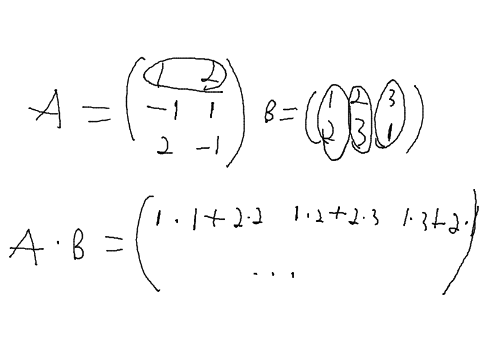
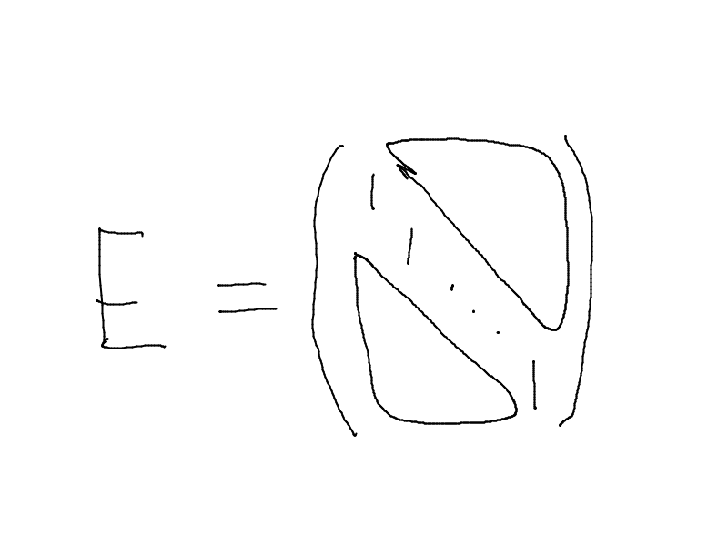

# Матрицы и операции над ними

$A_{m\times n}$- матрица размером $m$ строк на $n$ столбцов

## Сложение

**Суммой** двух матриц одинаковой размерности называются матрицы той же размерности, каждый элемент которой равен сумме соответствующих элементов матрицы:
$c_{ij} = a_{ij} + b_{ij}$

$$
A = 
\left( {\begin{array}{cc}
    1 & 2 \\
    3 & 4\\
    5 & 6
  \end{array} } \right)
\quad
B = 
\left( {\begin{array}{cc}
    -2 & 1 \\
    0 & 1\\
    2 & 3
  \end{array} } \right)
\quad
A+B = 
\left( {\begin{array}{cc}
    -1 & 3 \\
    3 & 5\\
    7 & 9
  \end{array} } \right)
$$

### Свойства операции сложения

1. Сумма любых двух матриц одинаковой размерности определена и однозначна
2. Коммутативность
3. Ассоциативность
4. Нулевая матрица(матрица, заполненная нулями) играет роль нуля
5. $\forall A \quad A+(-A)=O$ (нулевая матрица)

$$
A = 
\left( {\begin{array}{cc}
    a_{11} & a_{12} & \dots & a_{1n} \\
    \vdots\\
    a_{m1} & a_{m2} & \dots & a_{mn} \\
  \end{array} } \right)
\quad
B = \left( {\begin{array}{cc}
    b_{11} & b_{12} & \dots & b_{1n} \\
    \vdots\\
    b_{m1} & b_{m2} & \dots & b_{mn} \\
  \end{array} } \right)\\
\ \\
A+B = 
\left( {\begin{array}{cc}
    a_{11}+b_{11} & a_{12}+b_{12} & \dots & a_{1n}+b_{1n} \\
    \vdots\\
    a_{m1} + b_{m1} & a_{m2} + b_{m2} & \dots & a_{mn} + b_{mn} \\
  \end{array} } \right)\\
\ \\
B+A = \left( {\begin{array}{cc}
    b_{11}+a_{11} & b_{12}+a_{12} & \dots & b_{1n}+a_{1n} \\
    \vdots\\
    b_{m1}+a_{m1} & b_{m2}+a_{m2} & \dots & b_{mn}+a_{mn} \\
  \end{array} } \right)\\
\Rightarrow A+B=B+A
$$

По сложению множество матриц одного размера образует комутативную группу (абелеву группу)

## Произведение

**Произведение** матрицы $A$ на $\lambda \in \R$ называется матрицы $B$, все элементы которой равны соответствующим элементам матрицы $A$, умноженным на $\lambda$

$$
B=\lambda\cdot A\\
b_{ij} = \lambda a_{ij}
$$

### Свойства произведения
1. Произведение любой матрицы на любое число определено и однозначно и результатом операции является матрица того же размера
2. $0\cdot A = O$
3. $1\cdot A = A$
4. $\forall \alpha, \beta \in \R \quad \forall A \quad (\alpha\beta)A = \alpha(\beta A)$
5. $\forall \alpha, \beta \in \R \quad \forall A \quad (\alpha + \beta)A = \alpha A + \beta A$
6. $\forall \alpha, \beta \in \R \quad \forall A_{m \times n}, B_{m\times n}\quad \alpha(A+B)=\alpha A + \alpha B$

## Умножение матриц
Умножать можно только такие матрицы, у которых количество столбцов первого множителя равно количества строк второго множителя $A_{m\times k} \cdot B_{k \times n}$

**Произведением** матрицы $A_{m\times k}$ на матрицу $B_{k \times n}$ называется матрица $C_{m\times n}$, такая что, каждый элемент этой матрицы $C$ равен сумме произведений элементов $i$-ой строки матрица $A$ и соответствующего элементо $j$-ого столбца матрицы $B$.

$$
c_{ij} = \displaystyle\sum_{p=1}^k a_{ip}b_{pj}
$$

$$
A = 
\left( {\begin{array}{cc}
    1 & 2 \\
    -1 & 1\\
    2 & -1
  \end{array} } \right)
\quad
B =
\left( {\begin{array}{cc}
    1 & 2 & 3 \\
    2 & 3 & 1
  \end{array} } \right)\\
A\cdot B = C_{3\times 3} = 
\left( {\begin{array}{cc}
    5 & 8 & 5 \\
    1 & 1 & -2\\
    0 & 1 & 5
  \end{array} } \right)
$$

$$
B\cdot A = D_{2\times 2} = \left( {\begin{array}{cc}
    1\cdot 1 + (-1)\cdot2 + 2\cdot 3 & 1\cdot2 + 2\cdot1 + 3\cdot(-1)\\
    2\cdot 1 + 3\cdot(-1)+1\cdot 2 & 2\cdot2+3\cdot1+1\cdot(-1)\\
  \end{array} } \right)= \left( {\begin{array}{cc}
    5 & 1\\
    1 & 6
  \end{array} } \right)
$$

Для умножения матриц комутативный закон **не имеет места**.

### Свойства умножения
1. $A_{m\times k} \cdot (B_{x\times p} \cdot C_{p\times n}) = (A_{m\times k} \cdot B_{x\times p}) \cdot C_{p\times n}$
2. $(A_{m\times k}+B_{m\times k})\cdot C = A_{m\times k} \cdot C_{k\times n} + B_{m\times k} \cdot C_{k\times n}$
1. $(\lambda \cdot A_{m\times k})\cdot C_{k\times n} = \lambda(A_{m\times k} \cdot C_{k \times n})$

## Умножение квадратных матриц одного порядка

Квадратные матрицы одного порядка можно складывать и умножать, результатом выполнения операции будет квадратная матрица того же порядка

**Теорема**: определитель квадратной матрицы одного порядка равен произведению опредетелей сомножителей

Если определитель отличен от нуля, то матрица называется невырожденной. Если определитель матрицы равен нулю, то матрица вырождена.

Произведение двух невырожденных квадратных матриц одного порядка, это невырожденная матрица того же порядка. Если же одна из матрица вырожденная, то их произведение тоже вырожденная матрица

Рассматриваем множнство квадратных матриц $n\times n$

$$
E =
\left( {\begin{array}{cc}
    1 & 0 & \dots & 0\\
    0 & 1 &  \dots & 0\\
    0 & 0 & \ddots & 0\\
    0 & 0 & \dots & 1 \\
  \end{array} } \right)\\
|E| = 1
$$

$$
A\cdot B = E\\
B \cdot A = E
$$

Матрицей A называется правой обратной матрицей для матрицы A, если при умножении справа на неё она даёт единичную матрицу. Соотвественно левой обратной матрицой, если при умножении слева на неё, она даёт единицу.

Для вырожденной матрицы обратной матрицы не существует.

Сконструируем матрицу, которую назовём присоединённой для матрицы $A$. В $k$-ом столбце матрицы $A$ мы постовим $A^*$ к $k$-ой строке матрицы $A$

$$
A =
\left( {\begin{array}{cc}
    a_{11} & a_{12} & \dots & a_{1n}\\
    a_{21} & a_{22} &  \dots & a_{2n}\\
    \vdots & \vdots &  & \vdots\\
    a_{n1} & a_{n2} & \dots & a_{nn} \\
  \end{array} } \right)\\
A^*=
\left( {\begin{array}{cc}
    A_{11} & A_{21} & \dots & A_{n1}\\
    A_{12} & A_{22} &  \dots & A_{n2}\\
    \vdots & \vdots &  & \vdots\\
    A_{1n} & A_{2n} & \dots & A_{nn} \\
  \end{array} } \right)\\
A\cdot A^* =
\left( {\begin{array}{cc}
    |A| & 0 & \dots & 0\\
    0 & |A| &  \dots & 0\\
    0 & 0 & \ddots & 0\\
    0 & 0 & \dots & |A| \\
  \end{array} } \right)\\
= |A|\cdot E\\
A^*\cdot A = A\cdot A^*\\
A\cdot \frac{1}{|A|}A^*=E\\
A^{-1}=\frac{1}{|A|}A^*
$$

Для любой квадратной невырожденной матрицы существует обратная матрица. Обратная матрица перестановочна с данной матрицой и вычисляется по формуле $A^{-1}=\frac{1}{|A|}A^*$