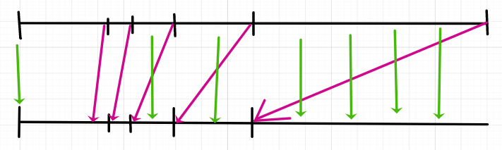
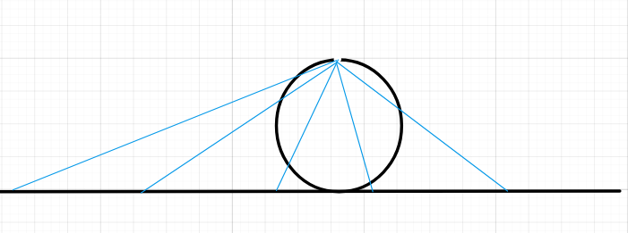
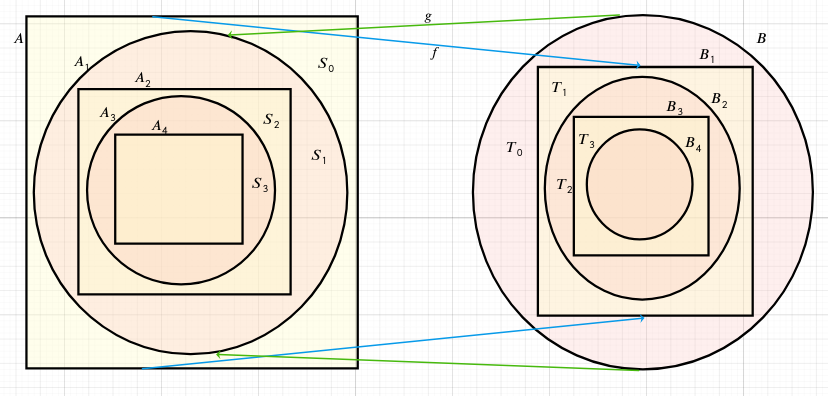

# Континуальные множества - множества, равномощные отрезку

**Наблюдение**: множество точек на отрезке $[0,1]$ равномощно множеству точек на интервале $[0,1)$.

Можно определить биекцию

$$
f(x) = 
\begin{equation}
    \begin{cases}
      x, x \ne \frac{1}{n}, n \in \N \setminus \{0\}\\
      \frac{1}{n+1}, x = \frac{1}{n}
    \end{cases}\,
\end{equation}
$$

Тут образ $[0,1) : f(1) = \frac{1}{2} \textrm{ всегда } f(x) \le x$

Инъекция: не - дроби переходят сами в себя, поэтому образы различных различны.

Дроби переходят в дроби, поэтому образ не - дроби и образ дроби не совпадают

Разные дроби переходят в разные дроби

Сюръекция: у не-дроби прообраз - она сама, у дроби - предыдущая

$$
Аналогично \ [0,1) \cong (0,1)\\
(0,1)\cong \R\\
\textrm{Первое рассуждение : геометрическое (на рисунке) }\\
\textrm{Второе рассуждение : } f(x) = tg(\pi x - \frac{\pi}{2}), f : (0, 1) \to \R\\
\textrm{Аналогично любой отрезок } [a,b] \textrm{, любой интервал } (c,d) \textrm{, любой интервал } [x,y) равномощные \R и друг другу
$$

## Как соотносятся $\R$ и множество всех бесконечных двоичных (или десятичных) дробей?

Как строится бесконечная двоичная дробь, например, для полуинтервала $[0,1)$?

Берём точку, сравниваем с $\frac{1}{2}$. Если $\ge$, пишем $1$, если $<$, пишем $0$

Далее сравниваем в первом случае с $\frac{3}{4}$, во втором с $\frac{1}{4}$. Если $\ge$, пишем $1$, если $<$, пишем $0$. И так далее.

*Особенность*: нельзя получить $01111\dots$ после какого-либо начала. (Для такой точки нужно писать $100000\dots$)

Т.е. получается биекция не между $[0,1)$ и всеми бексонечными двоичными последовательностями, а только между $[0,1)$ и последовательностями без 1 в периоде на конце.

Однако таких исключений счётное множество, т.к. они задаются конечным предпериодом, а их счётное число

Можно среди остальных чисел найти другое счётное семейство (например, $T = \{\frac{1}{3},\frac{1}{9},\frac{1}{27},\dots\}$)

*Обозначим*, $I = [0,1), S = \{0,1\}^{\infty}, B - \textrm{ имеющее 1 в периоде}$

Мы доказали $I \cong S \setminus B$

*Но*: заметим, что раз $T$ счётно и $B$ счётно, то $T \cup B$ тоже счётно

Поэтому $I \cong S \setminus B = (S \setminus B \setminus T) \cup T \cong (S \setminus B \setminus T) \cup \N \cong (S \setminus B \setminus T) \cup T \cup B \cong S$

В итоге получаем $I \cong S$

### Теорема $S \cong S^2$

Теорема : $[0,1] \cong [0,1]^2$

Будем доказывать $S \cong S^2$

Нужно построить биекцию $\alpha \leftrightarrow \ (\beta,\gamma)$

$$
\alpha = (a_0,a_1,a_2,a_3,\dots)\\
\beta = (a_0,a_2,a_4,a_6,\dots)\\
\gamma = (a_1,a_3,a_5,a_7\dots)\\
(\textrm{т.е. разбиваем последовательность } \alpha \textrm{ на последовательность чётных и последовательность нечётных})\\
\textrm{Обратная функция: } \beta = (\beta_0, \beta_1, \beta_2), \gamma = (\gamma_0, \gamma_1, \gamma_2) \Rightarrow \alpha = (\beta_0,\gamma_0,\beta_1,\gamma_1,\beta_2,\gamma_2)
$$

*Получили, что любой другой квадрат равномощен отрезку, и вся плоскость $\R^2$ тоже*

Вопрос: а что с другими фигурами, например, кругами или треугольниками?

*Ответ даёт теорема Кантора - Бернштейна*

Определим $A \preceq B$, если $A \cong B' \subset B$ (A не более мощно, чем B)

Теорема: Если $A \preceq B \ и\  B \preceq A,\ то\ A \cong B$

Из этой теоремы можно заключить, что, например, любой круг равномощен любому квадрату: все круги равномощны за счёт гомотетии(любой круг можно растянуть), поэтому даннный круг равномощен маленькому кругу внутри квадрата.

Но и квадрат равномощен маленькому квадрату внутри круга.

Применив теорему Кантора-Бернштейна, получаем, что круг и квадрат равномощны

$$
A_0=A\\
B_0=B\\
f: A_0 \to B_1 - биекция\\
g: B_0 \to A_1 - биекция\\
B_{i+1} = f(A_i)\\
A_{i+1} = g(B_i)\\
S_i = A_i \setminus A_{i+1}\\
C = \cap_{i=0}^{\infty}A_i\\
D = \cap_{i=0}^{\infty}B_i
$$

Например, $f$ задаёт биекцию между $S_i$ и $T_{i+1}$

$S_i = A_i \setminus A_{i+1}$

$f(A_i) = B_{i+1}, f(A_{i+1})=B_{i+2},\ поэтому \ f(S_i) = f(A_i \setminus A_{i+1})=B_{i+1}\setminus B_{i+2} = T_{i+1}$

Почему верно предыдующее. Пусть $x\in A_i \setminus A_{i+1}$. Тогда в частности, $x \in A_i$, поэтому $y = f(x) \in B_{i+1}$. Если при этом $y \in B_{i+2}$, то должен найтись $x' \in A_{i+2}$, т.ч. $f(x') = y$. Но точно $x' \ne x$, т.к. $\overline{(x\in A_{i+1})}. Получаем противоречие с инъективностью : x' \ne x, f(x') = f(x)$

При этом $f$ - биекция между $S_i$ и $T_{i+1}$

Инъекция - потому что она на всё множестве инъекция

Сюрекция: есил $y \in T_{i+1}$, то $y\in B_{i+1}$, потому $y = f(x)$ для $x\in A_i$. Если при этом неверно $\overline{(x\in S_i)}$, то $x\in A_{i+1}$, но тогда $y = f(x) \in B_{i+2}, тогда \overline{(y\in T_{i+1})}$

Противоречие, поэтому x \in S_i, поэтому сюръекция.

Аналогично $g$ задаёт биекцию между $T_i$ и $S_{i+1}$

Что касается $C \cong D$, о тут и $f$, и $g$ будут биекциями

$x \in C \Rightarrow \forall i, x \in A_i \Rightarrow \forall i f(x) \in B_{i+1} \Rightarrow f(x) \in D$

Итоговая биекция

$$
h(x) = 
\begin{equation}
    \begin{cases}
      f(x), x \in S_{2k}, k \in \N\ или \ x\in C\\
      g^{-1}(x), x \in S_{2k+1}, k \in \N
    \end{cases}\,
\end{equation}
$$

# Бинарные отношения (отношения эквивалентности и порядка)

**Бинарным отношением** на множестве A называется любое подмножество $A\times A$

(Идея: отношение "меньше или равно" отождествляется с множеством пар (x,y), для которых $x \le y$)

Часто вместо $(x,y) \in R$ или $R(x,y) = 1$ пишут $xRy$

Важные характеристики отношений:
1. Рефлексивность : $\forall x \quad xRx$ (Например, $\le, \equiv, (\mod k), \cong$)
2. Антирефлексивность : $\forall x \quad \overline{(xRx)}$ (Например, $<, ||$)
3. Симметричность: Если $xRy$, то $yRx$ (Например, $||, \cong, \equiv$)
4. Антисимметричность: Если $xRy$ и $yRx$, то $x = y$ (Например, $\le, \subset$)
5. Транзитивность: Если $xRy$ и $yRz$, то $xRz$ ($\le, <, \equiv$)

- Отношение эквивалентности: рефлексивность, симметричность и транзитивность
- Отношение нестрого частичного порядка: рефлексивность, антисимметричность и транзитивность
- Отношение строгого частичного порядка: антирефлекисвность, антисимметричность и транзитививность